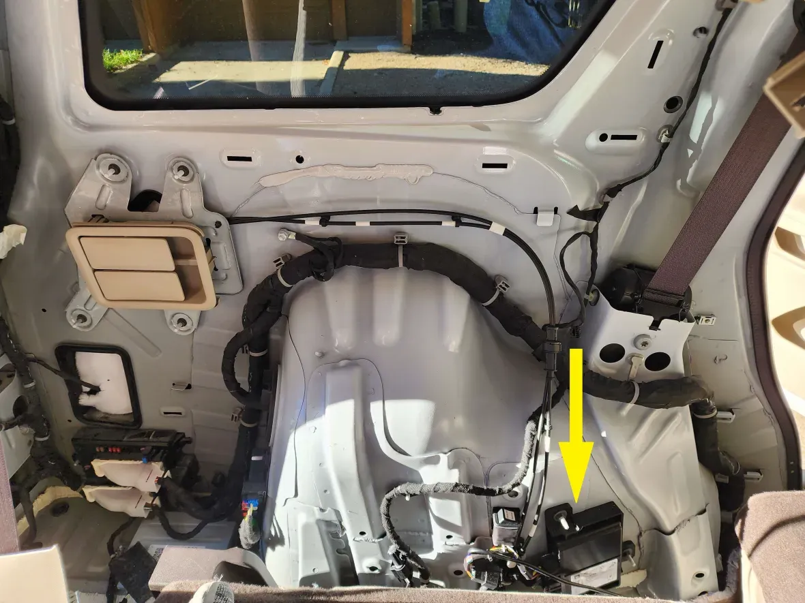
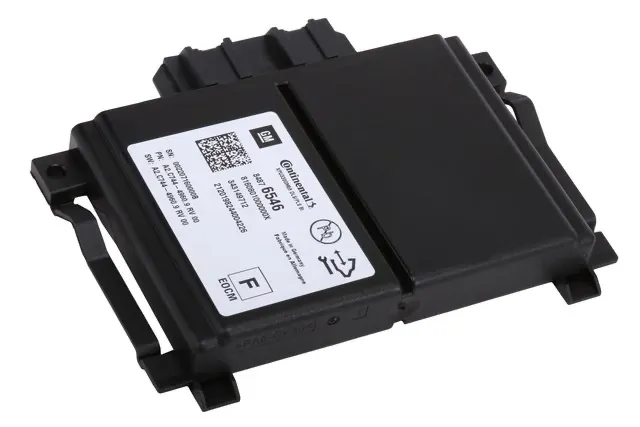

# ASCM Harness Plus

## Where to buy

Link to my Store:&#x20;

ASCM Harness Set: [https://shop.tlbb.ca/products/ascm-harness](https://shop.tlbb.ca/products/ascm-harness)

Harness Box 2x9 pin & 2x 13 pin: [https://shop.tlbb.ca/products/openpilot-harness-box-v1-2x13-pin-and-v2-2x9-pin-with-rj-45-port](https://shop.tlbb.ca/products/openpilot-harness-box-v1-2x13-pin-and-v2-2x9-pin-with-rj-45-port)

Link to my Etsy Store:

ASCM Harness Set: [https://www.etsy.com/ca/listing/1840105495/ascm-harness](https://www.etsy.com/ca/listing/1840105495/ascm-harness)

Harness Box 2x9 pin & 2x 13 pin: [https://www.etsy.com/ca/listing/1800366135/openpilot-harness-box-v1-2x13-pin-and-v2](https://www.etsy.com/ca/listing/1800366135/openpilot-harness-box-v1-2x13-pin-and-v2)

Link to RetroPilot store:

ASCM Harness Set: [https://shop.retropilot.org/product/ascm-harness/](https://shop.retropilot.org/product/ascm-harness/)

***

## Product Description

ASCM Harness Plus is for steering control \
The "Plus" means it is ready to use with SASCM Module for Openpilot Longitudinal control.&#x20;

This harness is 2x9 pin and works with 2x9 pin harness box

**Supported vehicles:**

* Chevy Volt (2016-2018)  （with Adaptive Cruise Control）- _pedal also needed_
* Acadia Denali （2018）
* Chevy Malibu (Before 2018)
* Regal TourX&#x20;
* Cadillac ELR (2014) - _Possibly work_
* Cadillac Escalade (2017-2020)  （with Adaptive Cruise Control） - _Possibly work_
* Cadillac Escalade ESV (2019-2020)  （with Adaptive Cruise Control） - _Possibly work_

<figure><figcaption></figcaption></figure> <figure><figcaption></figcaption></figure>

**Please make sure your vehicle has ASCM harness connection point to proceed**

### ASCM Connection diagram with SASCM:

<figure><figcaption></figcaption></figure>

### **Where to find your ASCM connection point:**

An ASCM is a module mounted in the left rear inner quarter and it would need to be bypassed.

<figure><figcaption></figcaption></figure>

A close-up picture:

<figure><figcaption></figcaption></figure>

What the module looks like:

<figure><figcaption></figcaption></figure>

Here is the example location for **Regal TourX**:

<figure><figcaption></figcaption></figure> <figure><figcaption></figcaption></figure>

## Installation Guide

This is how you connect older style harness: https://docs.google.com/document/d/1bAoENo8edsbknXUx6bcx-L0-9dbgItJRCfd6DIyGDN0/edit?tab=t.0\
For the new ASCM harness, please locate the ASCM module and run the harness like a normal openpilot setup.

<figure><figcaption></figcaption></figure>

<figure><figcaption></figcaption></figure>

<figure><figcaption></figcaption></figure>

<figure><figcaption></figcaption></figure>

