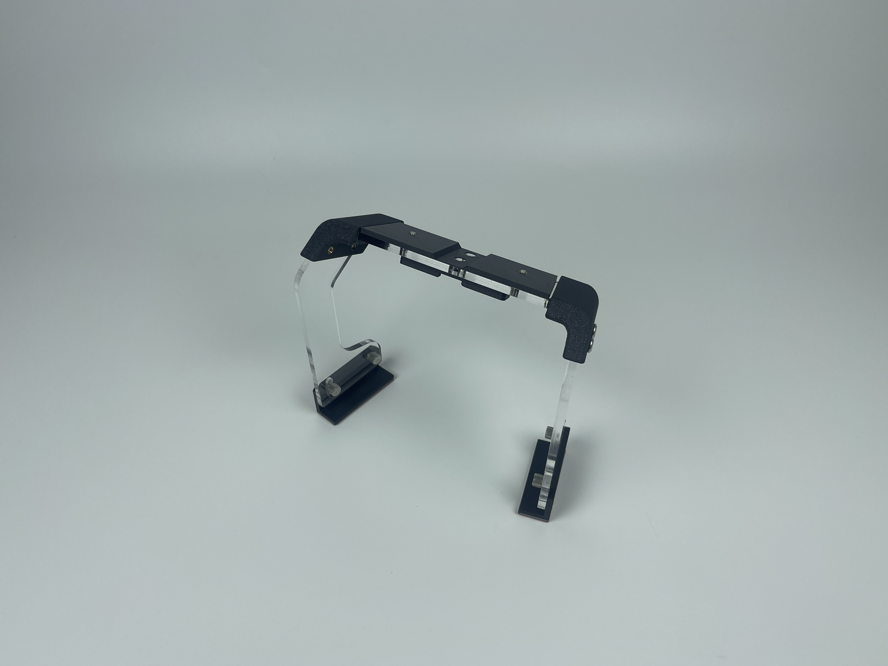

# Bear Tech Product Development Road Map and Progress Tracker

Welcome to the official roadmap tracker for BearTech Workshop products. This page serves as a living document where we log the journey of every product we've brought to life—from the first spark of an idea to real-world usage.

***

### Magmount Basics for C3/C3X

Updated: 10/12/2024

<figure><figcaption></figcaption></figure>

I live in BC, Canada. Here, the temperature never gets too hot for the device to overheat. But Smash and Grab have become more severe recently. That's why I'm also in need of a way to hide away my device.

The Magnetic mount solution from the community doesn't address this issue very well. I'm too lazy to store it in the glove box or the center console. Think about the process: You have to go into your glove box, reach for the device, take it out of the box if you don't want to scratch it, reach over the windshield, and mount it every time you enter the car. That's too much work!

This got me thinking, and I came up with a solution. In the premium set, I included a dummy mount. You can stick the dummy mount under the dash and then attach your device to it for storage. When you enter the car, grab your device and attach it to the real mount on the windshield before you even sit.

### Add-Ons for Magmount: Cover B, Angle Wedges & Comma Mount Adapter

Updated: 01/18/2025

<figure><figcaption></figcaption></figure> <figure><figcaption></figcaption></figure>

<figure><figcaption></figcaption></figure>

After we launched the Magmount, I thought we had solved the core challenge: a solid, secure, and convenient way to mount your Comma device. But as more users started sharing their setups and requests, it became clear—there were still a few pain points we hadn’t tackled yet. These three add-ons—**Cover B**, **Angle Wedges**, and the **Comma Mount Adapter**—were all born directly from community feedback.

**Cover B**

Originally, the Magmount came with a dust cover designed for the **windshield mount**—mainly to protect the magnetic pins from moisture and debris when the device was removed. But then, some users reached out and said:

> “I store the device mount in my bag—do you have something to protect _that_ too?”
>
> “I want to keep both mounts clean while they’re not connected.”
>
> “Hey, I lost the cover already—any chance you sell spares?”

And that’s when the idea clicked: why not make a cover that works for **both parts**?

**Cover B** was created to do just that. It fits not only the windshield mount, like the original, but also the **device mount**, giving you full protection whether the setup is on the windshield or tucked away in a glove box or backpack. It’s a small touch, but one that makes a big difference for people who are constantly swapping between storage and use.

**Angle Wedges**

Another batch of emails came in with a common theme—“My device is angled too far back.”\
Turns out, a lot of larger vehicles (especially SUVs and trucks) have steep windshields that tilt the device more than 5°, which can throw off visibility or even functionality.

Some of the vehicles reported by users:

* Toyota Highlander (8°)
* Honda Pilot (8°)
* Ford F150 (8°)
* Ford Maverick (8°)
* Rivian Truck & SUV (8°)

With that feedback in hand, we designed **Angle Wedges** to compensate for these angles. Snap them in between the windshield mount and the glass, and they’ll bring your device back to a more neutral position. It's a small, invisible fix that makes a big difference in large vehicles.

**Comma Mount Adapter**

Then came the minimalists and the realists. People who already had the **Comma windshield mount** installed and didn’t want to remove it, especially if it was on tinted areas or firmly adhered.

The messages went something like:

> “Love your mount, but I’m not peeling off the Comma one just to test it.”\
> “Is there a way to use your Magmount with the existing Comma base?”

Yes, now there is.\
The **Comma Mount Adapter** is designed for exactly this scenario. It bridges your Magmount device to the factory Comma windshield base—no extra adhesive, no removal needed. Just click it in, and go.

Each of these accessories wasn’t in the original plan, but they’re now a core part of the ecosystem—thanks to your feedback. If you ever messaged me with a suggestion, just know: it probably helped shape one of these.

### Screen Protector For Comma C3/C3X&#x20;

Updated: 4/03/2025

<figure><figcaption></figcaption></figure> <figure><figcaption></figcaption></figure>

I drive with a Comma device every day—and if you do too, you probably know what I mean when I say: **High beams from the rear are most annoyed**.

There were plenty of times the reflection off the screen made it hard to see anything clearly while driving. I wanted a **matte screen**—something that would cut the glare and still keep the display sharp. At the same time, I once dropped my device and scratched the surface. That was a wake-up call: no matter how advanced the Comma is, it’s still a phone at heart, and its screen is just as vulnerable.

So I started looking into screen protectors.

At first, I tried **tempered glass**. It felt premium, sure—but the glare was still there. The matte finish? Nowhere to be found. Plus, since glass is rigid, it didn’t wrap around the subtle curves, leaving the edges exposed. It didn’t feel right.

So I shifted to **hydrogel film**. It’s flexible, low-profile, and could actually provide edge-to-edge protection. Then came the long part—**months of sourcing and testing**. I contacted dozens of manufacturers, compared sample after sample, and eventually met a promising supplier at CES.

They had all kinds of protectors, including one special tempered glass version they claimed was anti-glare. We gave it a shot—and while the marketing was ambitious, let’s just say the results didn’t match. It was still reflective and **10 times the price**. A polished way to waste money.

After all that, we went back to the hydrogel—**specifically, matte hydrogel film**. It worked. It looked good. It reduced glare. It felt smooth.

We initially made a mix pack with **2 matte** and **2 ultra-clear** versions. But as feedback rolled in, it was obvious—**people preferred the matte**. So now, we’re offering a 4-pack of the matte version only.

If you’re like me and tired of driving with a mirror on your dash, this might be the simplest fix.

### IR Filter

Updated: 4/23/2025

<figure><figcaption></figcaption></figure>

The Comma device is great at tracking your face, even at night—and that’s thanks to the infrared light it emits. But there’s a side effect that caught a lot of us off guard: **that same IR light can interfere with your car’s auto-dimming rearview mirror**.

So we made the **IR Filter**.

The filter’s job is simple: **block the Comma’s infrared light from reaching the mirror’s dimming sensor**, so the mirror can function like it’s supposed to.

Finding IR-blocking material was the easy part. The real challenge was installation. We tested across a wide range of vehicles and found that auto-dimming sensor locations and angles vary wildly—centered, off to the side, tilted, you name it.

To solve this, we included **4 pre-applied VHB pads** with every IR Filter. You can use anywhere from 1 to 4 pads depending on your sensor’s position. This gives you the flexibility to find the perfect mounting angle for your specific mirror—without any extra tools or guesswork.

It’s a small addition, but it restores an essential function—one you probably didn’t even realize was gone until your eyes started hurting on a night drive.

### Device Stand

Updated: 5/05/2025

<figure><figcaption></figcaption></figure> <figure><figcaption></figcaption></figure>

This one’s a bit personal.

As a tinkerer, I’m constantly uploading logs, switching forks, testing features—it never stops. That means I bring my Comma device home pretty often. And when I do, I usually just want to **set it down and plug it in**.

But here’s the thing: the Comma device doesn’t have a flat back. It has a **lens**, some curves, and no obvious surface to rest it upright. I used to lay it on its side, or prop it up awkwardly with whatever I had nearby—definitely not ideal.

Once the **Magmount** was out, I realized it could do more than just live in the car. It could become part of a clean home setup too. That’s when the idea of the **Device Stand** started to take shape.

Now, instead of plugging and unplugging cables every time, I just place it on the stand. It locks into place magnetically, charges if I need it to, and is always ready for the next test run. **No more fumbling, no more wire stress.**

I know this isn’t a major community-wide need. But it’s something that made my workflow better—and I figured if I needed it, someone else probably did too.

Then, while testing it, something unexpected came up.

A few community members reached out with a different use case:

> “I don’t want my device hanging on the windshield.”\
> “Can you make something that sits above the infotainment screen instead?”

So we adjusted. The stand was redesigned with two modes:

* A **handle mode** for home/desk use
* A **no-handle mode** that can be positioned behind your infotainment screen, using an arc or mount setup

That way, whether you’re a contributor like me running logs at your desk, or a clean-dash enthusiast who wants a low-profile in-car setup—we’ve got you covered.

It’s a small accessory, but a thoughtful one—born from the everyday use of a Comma device by people who live and breathe this stuff.

### Carry Case for C3/C3X

Updated: 5/24/2025

<figure><figcaption></figcaption></figure> <figure><figcaption></figcaption></figure>

Last December, a few community members asked me about a carrying case so they could take their device home without worrying about dropping it and damaging the screen or lens.\
C3 and C3X aren't designed for carrying around, and I understand why Comma designed the devices this way. But some community members do need to take them home or to the office when their car is parked.\
I initially made one with a 3D-printed hard shell case and a 3D-printed TPU insert. It wasn't as good-looking as the current one and wasn't up to my standards, so I scrapped it.\
Then, I started my buying streak of cases and looked for the right insert material. To list a few cases that I have purchased: hard cloth, soft cloth, pelican-like hard plastic, metal, acrylic, and wood. The list goes on. They are either too big or too small or have no protection, just not up to the standard.\
And that's not the only hurdle I encountered. The size listed has always been incorrect. In fact, I have 3 different sizes of the same style case above. Pair that with slow Canadian shipping.\
The case isn't the only problem. It took more time to check the design of the foam inside so it would fit both the C3 and C3X, as well as several different mounts on the market. I'm aiming for the best compatibility.\
The last change was the thumb cut-off. It always felt weird to take the device out by grabbing it from the back. With the thumb cut off, I can reach in and take it out with one hand and mount it to the windshield with a mag mount. It turns out that hole also made it compatible with another community-made C3X that has a USB-C port on the side—what a coincidence.\
After 5 months and no less than 10 iterations of the case selection and foam design, I present to you the carrying case solution that's not just functional but also stylish (IMO).\
The limited bonus item is an idea from a friend who mentioned that if someone wants to protect their device with a case, they probably want a screen protector. Thus, I sourced it and included it as a bonus. I hope my friend is right and that people who purchased it like it. It is an ultra-clear screen protector. If you are looking for a matted one, you can find them here: https://shop.tlbb.ca/products/c3-c3x-screen-protector\

### Behind the Case: What We Tried Before

**An Add-On to the Carry Case Story**

Updated: 5/25/2025

After we launched the final carry case for the Comma 3 and 3X, I thought it might be interesting to share a bit of what **didn’t** make the cut.

This case went through more prototyping and sourcing than most people would believe. We didn’t just settle on the first decent box we found—we tried everything from rugged hard shells to sleek cloth styles. Many were eliminated on the spot, but these are the ones that made it home for actual testing.

***

**All the Cases We Sourced and Tested**

<figure><figcaption></figcaption></figure> <figure><figcaption></figcaption></figure>

These two photos capture the bulk of what we ordered in. From early contenders to long-shot experiments. Some looked great, some felt durable—but **none were just right**.

***

**Pelican-Style Hard Cases**

<figure><figcaption></figcaption></figure>

These came up first in community feedback—**rugged, waterproof, tough as nails**. But they all shared one major flaw: **they’re huge**. Glove box? Not a chance. Backpack? Tight squeeze. And walking around with one felt like carrying a briefcase full of cash. Not the low-key look we were going for.

***

**Cloth Cases – Hard and Soft Variants**

<figure><figcaption></figcaption></figure>

We tried plenty of these too. The **hard cloth cases** offered some structure, and the **soft ones** were lightweight. But the styling wasn’t great, and none of the sizes quite hit the mark. They just didn’t feel like a product we’d want to put our name on.

***

**Finalist Styles – Travel-Case Inspired**

<figure><figcaption></figcaption></figure>

This is where the breakthrough happened. These sleek, luggage-style cases were **protective, compact, and actually good-looking**. We tested different finishes (metallic, matte, black, champagne gold) and finally landed on our signature gunmetal with diagonal ribs.

***

**TPU Insert Prototypes**

<figure><figcaption></figcaption></figure>

Before we finalized the foam insert, we 3D-printed some slick TPU molds. They looked cool—and were fun to prototype—but didn’t absorb impact well. Plus, once we factored in the Magmount attached to the device, **the fit failed**. Back to the drawing board.

***

**CNC-Cut Foam Inserts – The Final Answer**

<figure><figcaption></figcaption></figure>

After many layout tweaks, this foam gave us exactly what we wanted: a **secure fit**, drop protection, and modular options for different accessories. We added a **thumb cut-out** so you can lift your device out easily with one hand, and we **glued the foam into the case** to prevent shifting or pop-out accidents.

***

This update isn’t about what succeeded—it’s about what _didn’t_, and how each misstep helped us inch closer to a case that really works.

Thanks to everyone in the community who shared what they wanted. Your input helped shape not just what we built—but what we **chose not to build**.

Please join our discord to leave your feedback: [http://discord.innoisle.com/](http://discord.innoisle.com/)

***

