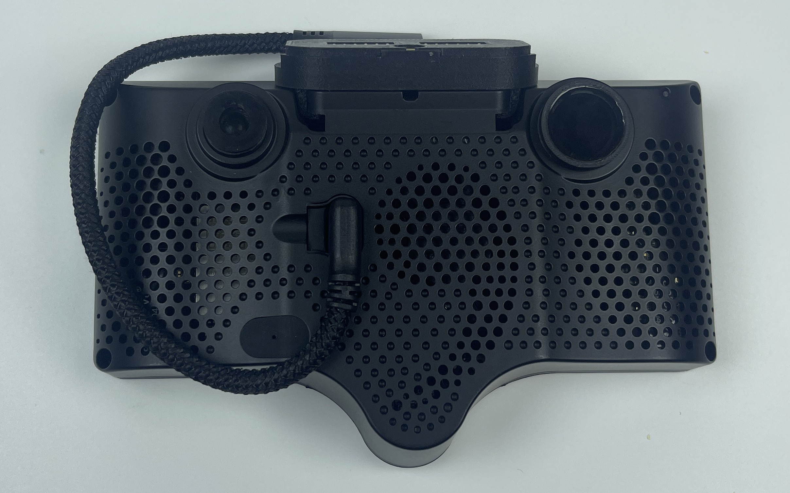

# CPL Filter

## Where to buy

Link to my Store:&#x20;

CPL Filter: [https://shop.tlbb.ca/products/](https://shop.tlbb.ca/products/ir-infrared-filter-for-rearview-mirror-dimming-sensor)CPL\_filter

Link to my Etsy Store:

CPL FIlter: [https://www.etsy.com/ca/listing/C](https://www.etsy.com/ca/listing/1904694297/ir-infrared-filter-for-auto-dimming)PL\_filter

***

## Product Description

### **CPL Filter Set for Comma 3 / Comma 3X**

**Reduce Glare. Improve Vision. Enhance Model Performance.**

<figure><figcaption></figcaption></figure> <figure><figcaption></figcaption></figure>

Upgrade your Comma 3 or Comma 3X with this custom CPL (Circular Polarizing Lens) filter set — designed to reduce windshield glare and interior reflections that can interfere with OpenPilot’s camera vision, especially during bright, sunny drives.

#### **Key Features:**

* 🔧 **Perfect Fit** – Custom-sized CPL filters for both cameras on your Comma 3 / 3X.
* ☀️ **Minimize Reflections** – Cut down windshield glare and dashboard reflections that can interfere with ML performance.
* 🔍 **Tested with OpenPilot** – Carefully tested to confirm: the CPL filters do **not** block any part of the image used by OpenPilot’s ML model.
* 🧲 **Easy Installation** – Comes with pre-applied VHB tape and alignment stickers. No additional tools needed.

#### **What’s in the box:**

* 2x CPL Filters (Main cam + Wide cam)
* Pre-applied adhesive rings (VHB)
* Alignment aid stickers

<figure><figcaption></figcaption></figure>

***

#### **Why CPL Filters Matter for Comma Devices:**

CPL (Circular Polarizing Lens) filters work by **blocking polarized light**—the kind often caused by reflections on glass surfaces like your windshield. These reflections can confuse vision-based systems like OpenPilot, especially when they obscure key features like lane lines or nearby vehicles.

By adding a CPL filter, you're giving your Comma device a cleaner, clearer view of the road ahead. This results in **better model confidence**, especially in high-sun or high-glare conditions.

***

#### **Still Worried About View Obstruction?**

We've done extensive testing.

<figure><figcaption></figcaption></figure>

In the image above, you’ll see:

* 🟩 **Green box** = the actual camera feed used by OpenPilot
* 🔴 **Red circle =** the view available after applying the CPL filter.

As shown, the area used by openpilot is completely unobstructed. You get the benefit of glare reduction **without compromising vision or safety**.

***

#### **Compatibility:**

* ✅ Comma 3
* ✅ Comma 3X\
  (Might support other community devices)

Please join our discord to leave your feedback: [http://discord.innoisle.com/](http://discord.innoisle.com/)

***

