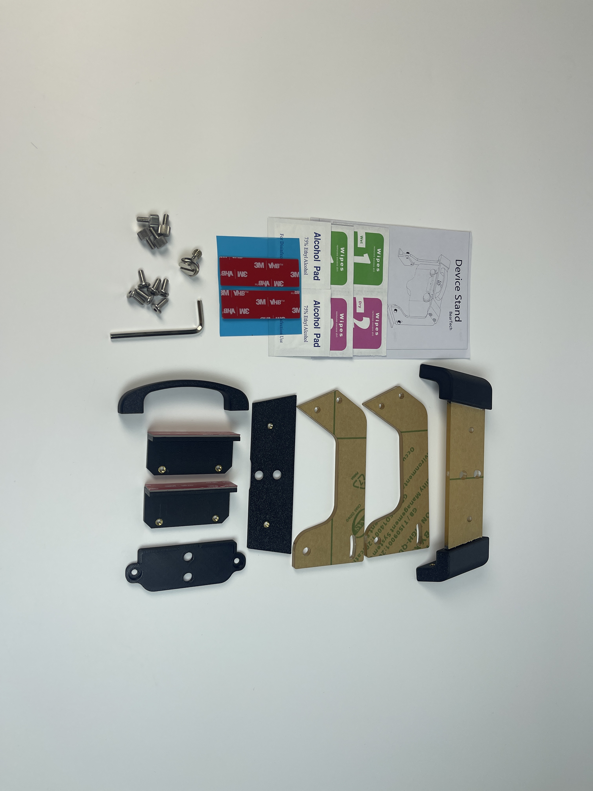
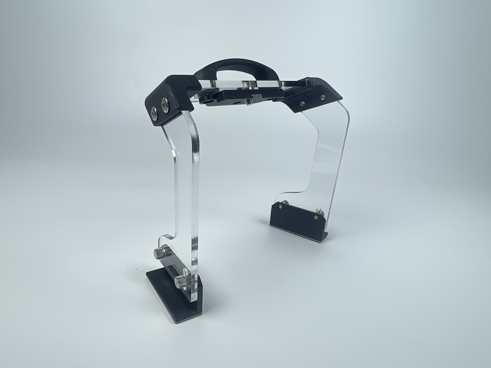
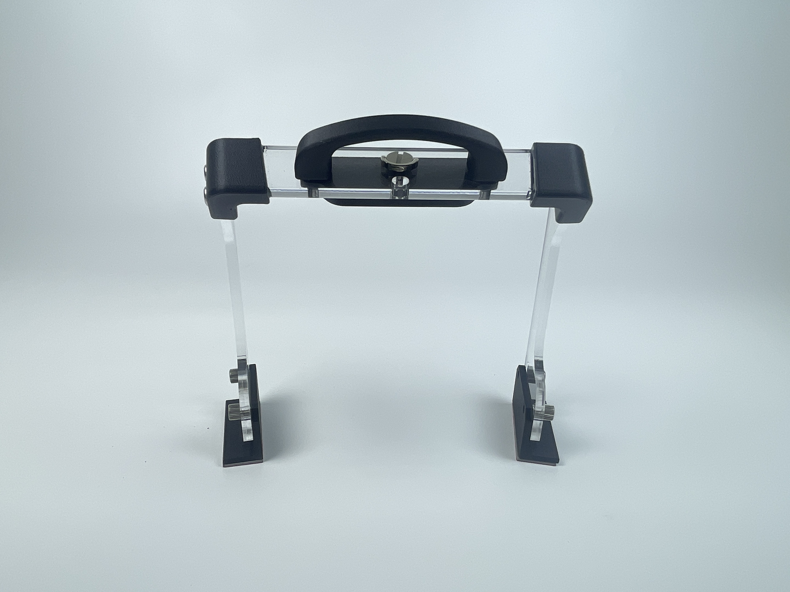
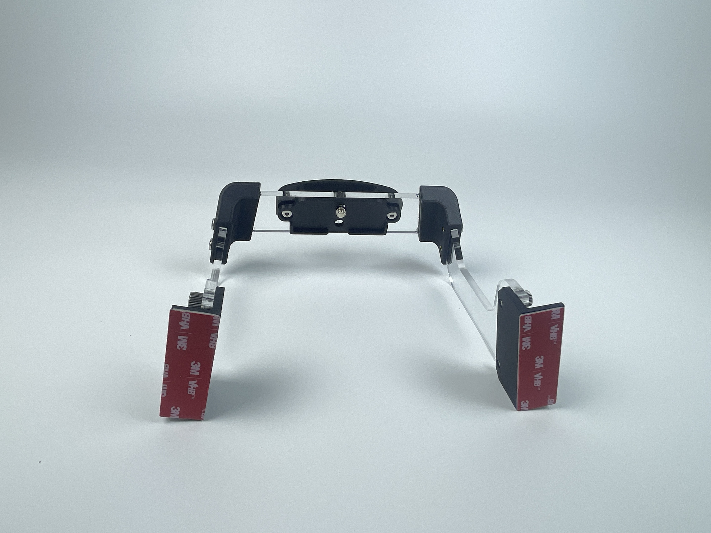
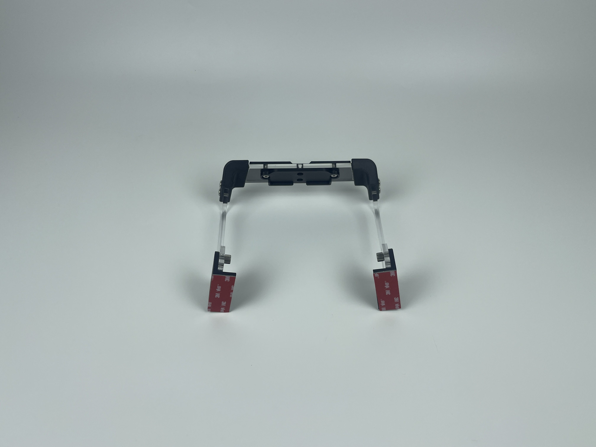
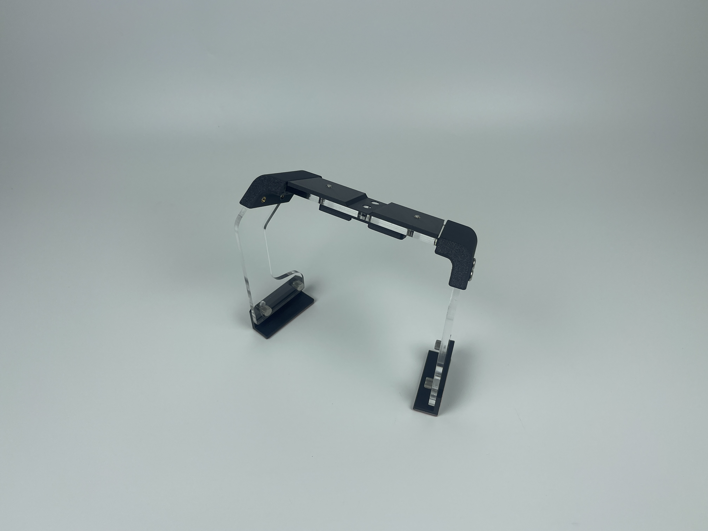
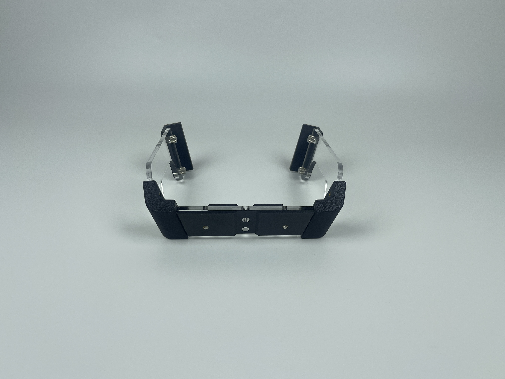
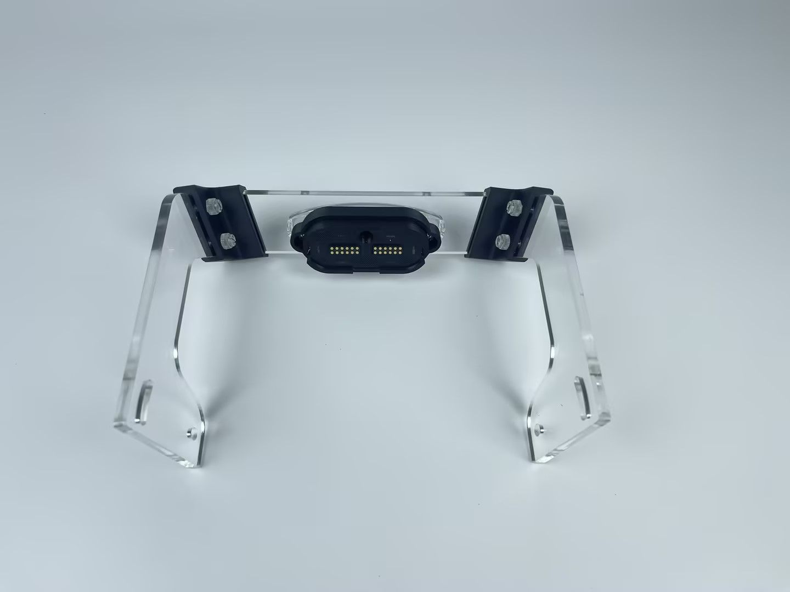
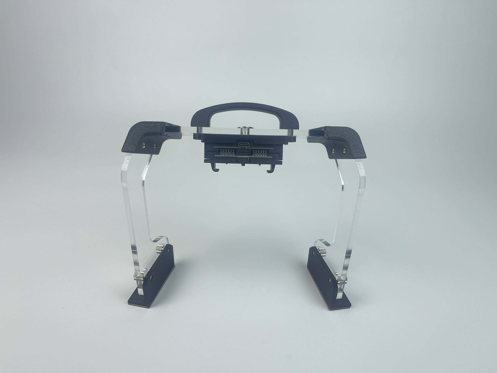
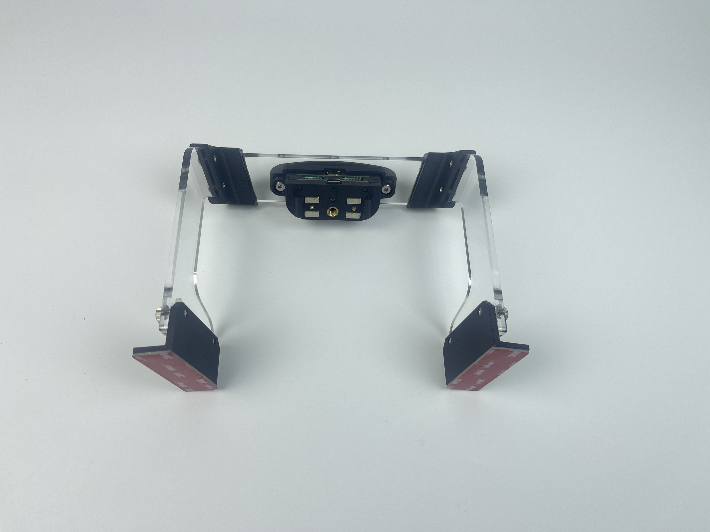

# Device Stand

## Where to buy

Link to my Store:&#x20;

OP Device Stand: [https://shop.tlbb.ca/products/op-device-stand](https://shop.tlbb.ca/products/op-device-stand)

Link to my Etsy Store:

OP Device Stand: [https://www.etsy.com/ca/listing/1904708571/op-device-stand](https://www.etsy.com/ca/listing/1904708571/op-device-stand)

Link to RetroPilot Store:

OP Device Stand: [https://shop.retropilot.org/product/op-device-stand/](https://shop.retropilot.org/product/op-device-stand/)

***

## Product Description

#### **OP Device Stand**

**What you will receive:**

<figure><figcaption></figcaption></figure>

**What it looks like after installation**&#x20;

**Install with handle option (for home use):**

<figure><figcaption></figcaption></figure> <figure><figcaption></figcaption></figure> <figure><figcaption></figcaption></figure>

**Install with a stand option (for car use):**

<figure><figcaption></figcaption></figure> <figure><figcaption></figcaption></figure> <figure><figcaption></figcaption></figure>

Introducing the **OP Device Stand** — the perfect solution for keeping your Comma device safe and secure while you work on updates, log uploads, or development. This **acrylic stand with a handle** allows you to place your Comma device on your desk or workspace securely, giving it a stable spot when not in use.

**Key Features:**

* **Designed for Secure Placement:** Ideal for **uploading logs, updating OpenPilot**, and for **development** purposes. It ensures that your device stays stable and secure while performing tasks.
* **Handle for Easy Mount Removal:** The built-in handle makes it easy to **pull the Magmount off** when needed.
* **Windshield or Alternative Mounting:** Requires an additional **windshield Magmount** or **Slidemount** for data transfer. If you already have a Magmount installed, you’ll need an extra windshield mount for the stand.
* **Unique Adjustable Feet Design:** For an alternative mounting option, the stand comes with **extra adjustable feet** that allow you to mount it behind your infotainment screen. This offers a lower placement if you don’t want to mount it on the windshield, reducing any potential obstruction of your view.
* **Easy Installation:** The stand comes in pieces of acrylic with 3d printed parts, and assembly is straightforward. **Installation instructions** are included to make setup easy.

Whether you're developing, uploading logs, or updating your OP, the **OpenPilot Device Stand** is the perfect solution to keep your Comma device accessible and organized.

**Using it with a Magmount**

<figure><figcaption></figcaption></figure> <figure><figcaption></figcaption></figure>

**Using it with a Slidemount**

<figure><figcaption></figcaption></figure> <figure><figcaption></figcaption></figure>

## Installation Guide

<figure><figcaption></figcaption></figure>

Please join our discord to leave your feedback: [http://discord.innoisle.com/](http://discord.innoisle.com/)

***

