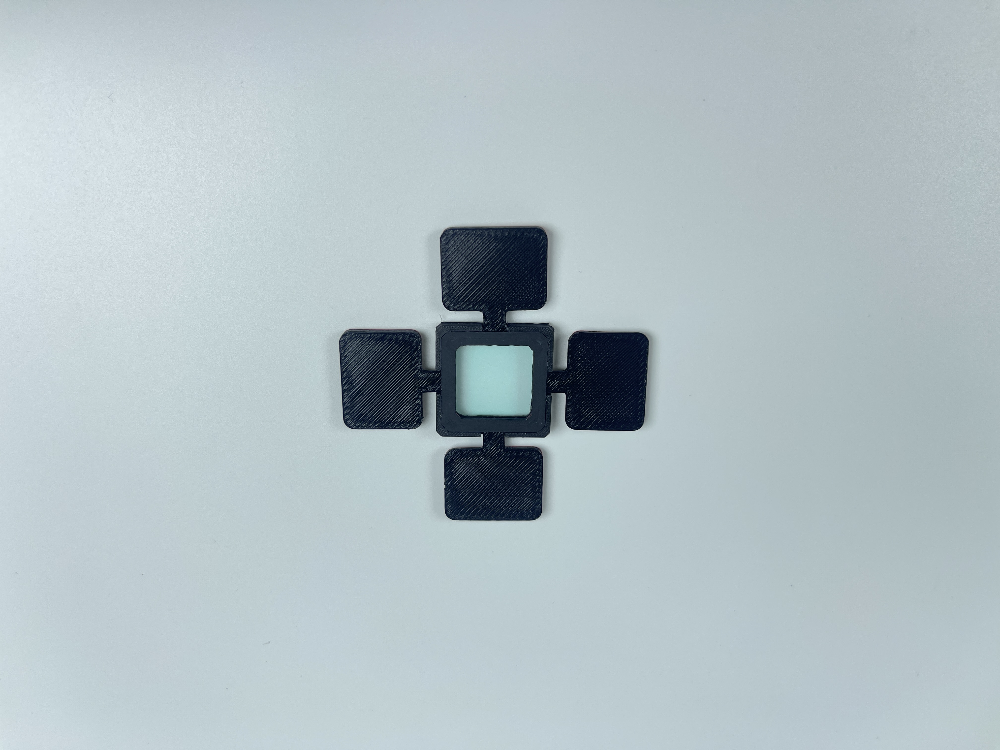

# IR (Infrared) Filter

## Where to buy

Link to my Store:&#x20;

IR Filter: [https://shop.tlbb.ca/products/ir-infrared-filter-for-rearview-mirror-dimming-sensor](https://shop.tlbb.ca/products/ir-infrared-filter-for-rearview-mirror-dimming-sensor)

Link to my Etsy Store:

IR Filter: [https://www.etsy.com/ca/listing/1904694297/ir-infrared-filter-for-auto-dimming](https://www.etsy.com/ca/listing/1904694297/ir-infrared-filter-for-auto-dimming)

Link to RetroPilot Store:\
IR Filter: [https://shop.retropilot.org/product/ir-filter/](https://shop.retropilot.org/product/ir-filter/)

***

## Product Description

#### **IR (Infrared) Filter for Auto Dimming Rearview Mirror Sensor**

<figure><figcaption></figcaption></figure> <figure><figcaption></figcaption></figure>

Our **IR (Infrared) Filter** is designed to solve the issue of infrared light emitted from the Comma device, which interferes with the auto dimming functionality of your rearview mirror. At night, the infrared light used by the Comma device to detect the driver's face can confuse the dimming sensor, affecting its functionality. This IR filter helps block the infrared light, ensuring your auto dimming rearview mirror functions smoothly without disruptions.

**Key Features:**

* **Customizable Fit:** The filter comes with **4 pre-applied VHB tape pads**, which can be placed around your rearview mirror's auto dimming sensor. Depending on the angle and location of the sensor, you can choose to use 1-4 pads.
* **Universal Compatibility:** This IR filter is designed to work with **any rearview mirror with auto dimming** functionality.
* **Easy to Install:** Simply apply the filter to your rearview mirror sensor. If certain VHB tape pads are not needed, simply cut them off for a clean fit.
* **Improved Dimming Sensor Performance:** By blocking infrared light emitted from the Comma device, this filter prevents interference, ensuring the auto dimming feature works smoothly without interference.

**How It Works:**

1. **Choose Your VHB Tape Pads:** Select the 1-4 VHB tape pads based on the placement and angle of your auto dimming sensor.
2. **Apply the Filter:** Stick the filter directly to your rearview mirror’s auto dimming sensor.
3. **Trim Unused Pads:** If any VHB tape pads are not required, simply cut them off to ensure a proper fit.

Please join our discord to leave your feedback: [http://discord.innoisle.com/](http://discord.innoisle.com/)

***

