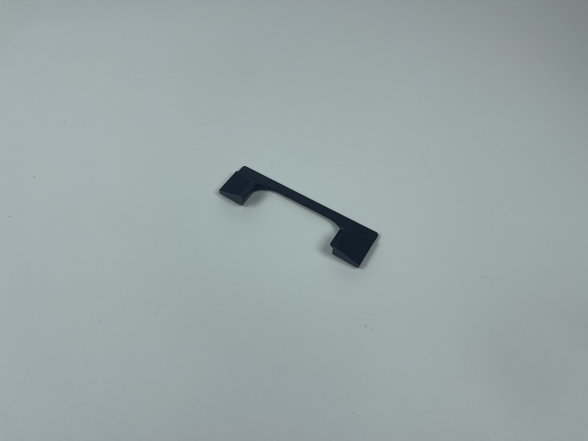
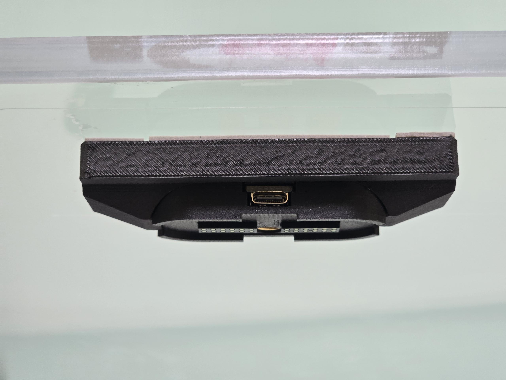
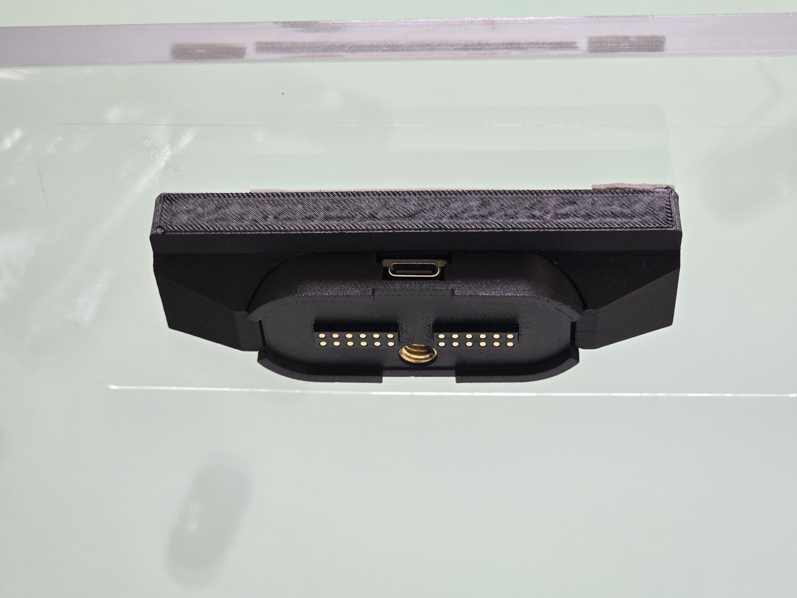
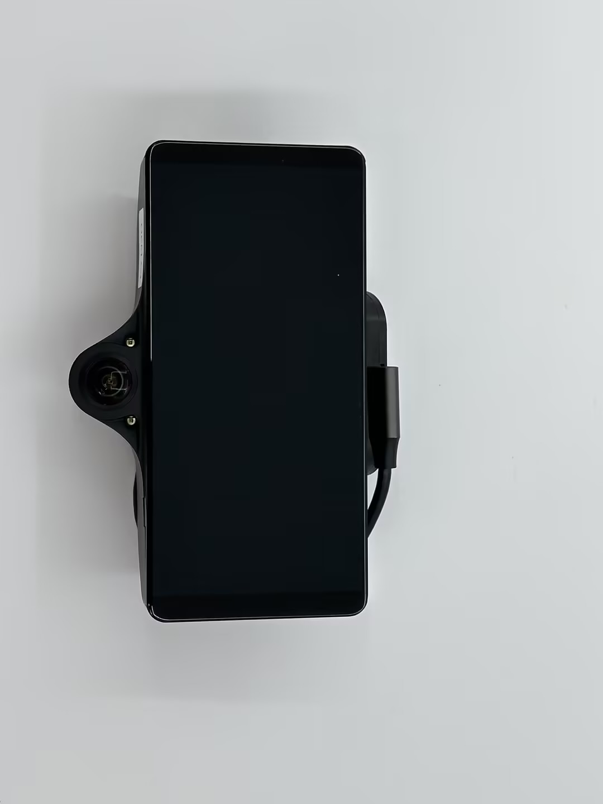

# Magmount & Slidemount Installation Guide - before 2025Aug1st

\*Disclaimer: This is a guide only.

**This installation guide applies to both magmount and slidemount.** \
**The difference will be indicated in the guide.**  

## Updates:

### Magmount Holder (Compatible with ONLY Magmount)


After we pre-applied VHB, with adhesion promoter properly applied, there has been no issue of VHB breaking off from the windshield mount.

There has never been an issue of VHB with Slidemount, so **Slidemount DOES NOT need a holder**.&#x20;

If you are still afraid of VHB peeling off the mount, you can add a magmount holder to hold the magmount in place.

This magmount holder will hold your magmount in place if the VHB peels off. It is unlikely that with the adhesive promoter applied, the VHB still peels off from magmount, but the holder acts as a last line of defence.
\
You can 3D print it with **PETG, ABS, ASA, and PA** materials, and cut a strip of VHB to stick it on the windshield over the magmount. (We use [ASA-CF material](../materials/3d-printing-filaments.md), which can also be found in our store)
\
The holder is designed not to be in contact with the Magmount. If the VHB tape ever fails, the magmount will drop onto the holder, and you can sway your device back and forth, which indicates that the VHB is peeled off.

Please find the 3D printing file in our discrod channel or contact us to get the file.\
We have 0 degree (standard) mount holder and 8 degree mount holder available.

**0° Magmount Holder Installation:**

<figure><figcaption></figcaption></figure> <figure><figcaption></figcaption></figure>

**8° Magmount Holder Installation:**

<figure><figcaption></figcaption></figure> <figure><figcaption></figcaption></figure>

### VHB Tape

We are currently in a transition phase, where we try to preapply VHB tape for the customer. However, due to time constraints, we might not be able to pre-apply for every single mount.&#x20;

If you received a Magmount/Slidemount with a gray pre-applied VHB, you **don't need to** prepare your Magmount. We have already prepared it for you. You also **don't need to stack two VHB** tapes with the gray VHB tape, since the gray one is thicker.

<figure><figcaption></figcaption></figure> <figure><figcaption></figcaption></figure>

Why are there two different types of VHB?\
Based on customer feedback, we found that some windshields are more curved. In this case, a thicker VHB would be helpful. Using the thick version VHB **OR** stacking 2 pieces of thin version VHB would have the same result.\
In some scenarios, adhesion promoter with 1 thin layer of VHB already works. The other pieces are all extras for testing and remounting purposes.&#x20;

You might need 1 layer/ 2 layers of VHB based on your local weather and windshield curvature.  (**Maximum 2 pieces** of thin version VHB and adhesion promoter is needed)\
There should be sufficient VHB included in your package.\
Please preapply adhesion promoter on your windshield mount before applying the VHB.

### **Set Screw:**

**\*Over-tightening the set screw could break your magmount/ slidemount**

For magmount set screw is **not required** unless you require extra tightness.\
\- **Do not over-tighten it**, as the screw is small and is only intended to prevent movement.

For Slidemount set screw instruction **(Set screw is required for Slidemount)**: \
\- Tighten the pre-install set screws at the left and right side of the Slidemount.\
\- Tighten it **just enough** that you can't move the Slidemount. \
\- **Do not over-tighten it**, as the screw is small and is only intended to prevent movement. (Over-tightening it will cause the breakage of the mounting bracket.&#x20;

<figure><figcaption></figcaption></figure>

**\*\*Example of an over-tightened set screw:**\
The set screw in the picture below is over-tightened way too much. \
Otherwise, the mounting bracket could break (as shown in the picture)

<figure><figcaption></figcaption></figure>

### **Warning:**&#x20;

**Slidemount may not support 3rd party comma devices, we don't guarantee compatibility of Slidemount on any device other than comma C3X, C3 and C2. Thank you for understanding.**

***

## Installation Steps

#### Before installing the magmount, please find the description for each component in your package here:


[magmount-c3.md](magmount-c3.md)


#### Prepare your magmount:

1. Warning: Apply the VHB tape to the magmount, angle wedges or comma mount adapter first before you stick it on the windshield. And apply the VHB in warm temp.\
   If you are reapplying the VHB tape, Clean the surface with isopropyl alcohol and ensure that no residue remains.
2.  **(Important)**  The ideal application temperature for VHB tape is above 70°F (21°C), with a minimum requirement of 50°F (10°C).

    If the temperature is below this minimum, please gently warm the application surface before and after attaching the MagMount. Exercise caution when heating the area to avoid overheating or damaging the surface.

    Please note that VHB tape requires these temperatures to cure properly. Allow the adhesive to cure for at least 24 hours (or 1.5 times the standard curing time recommended by 3M). Refer to the 3M datasheet snippet below for recommended bond times.
3. .png>)
4. Take the Windshield Side Mount and the Windshield Side Mount cover **(DO NOT open it up yet)**.
5. Wipe the back of the Windshield Side Mount with the IPA wipe.
6. Apply adhesion promoter to every surface that the VHB is going to stick to and let it dry. (If you have windshield tint, please try it on a small area first, some tint does not do well with the adhesion promoter)
7. Apply VHB tape to the Windshield Side Mount.
8. **Clamp or use weight** on the complete magmount for **at least 5 hours** so VHB makes perfect contact to the surface. **Every VHB-connected surface** needs to be clamped. (The complete magmount here means magount with VHB or the magmount with angle wedges and VHB or magmount with mount adapter sticked together. )
9. For the VHB that sticks to the windshield, you need to stack at least **two pieces VHB tapes** (each 1.1mm thick for a total of 2.2mm) so that the middle of the tape makes good contact with your curved windshield. You don't need to stack two pieces of VHB if you received the gray VHB that's thicker. (gray VHB is 1.6mm)

#### Magmount Windshield and Device Side Installation Guide

1. Place the Magnetic angle gauge **(Optional)** on the floor to make sure the ground is level

<figure><figcaption></figcaption></figure>

2. Place the 1.5m tape measure **(Optional)** vertically on the far left and right side of your windshield outside the vehicle. Use tape to secure if needed

<figure><figcaption></figcaption></figure>

3. &#x20;Center the 2m tape measure **(Optional)** on the windshield and mark 5cm down the radar

<figure><figcaption></figcaption></figure>

4. Rotate the 2m tape measure horizontally

<figure><figcaption></figcaption></figure>

5. &#x20;Mark the position where the Magmount will be installed
6. Use the Wet wipes **(VHB Tape pack)** to clean the marked area on the windshield inside the vehicle
7. Use the Dry wipes **(VHB Tape pack)** to further clean the same area on the windshield
8. Use the IPA wipes **(VHB Tape pack)** to thoroughly clean the marked area on the windshield
9. Apply the Static film **(VHB Tape pack)** to the windshield. **Note**: If temperatures exceed 40°C (104°F), avoid using the static film.
10. Take the Windshield Side Mount and the Windshield Side Mount cover **(DO NOT open it up yet)**.
11. See [#prepare-your-magmount](magmount-installation-1.md#prepare-your-magmount "mention")  applying VHB on Magmount. Remember to **clamp your mount** **and VHB** after you apply the VHB on the Magmount.
12. **(Important)** The ideal application temperature for VHB is above 70°F or 21°C. The minimum application temperature is 50°F and 10°C. If the temperature is lower than the minimum required, you can try to heat up the application area before and after attaching the magmount. Use common sense when heating the application area and avoid overheating or leaving it unattended. The VHB also need the above minimum required temperature for curing. Please leave it at least 24 hours or 1.5x the curing time recommended by 3M. Below is a snippet of recommended bond time from the 3M datasheet.\
    .png>)
13. For slidemount installation, you need to leave enough room to slide the mount in and out. Please leave minimum 3.5cm (1.4 inch)&#x20;
14. Attach the Windshield Side Mount to the Static film if you applied it in step 9, or attach it to the windshield if the static film isn't applied. Try not to leave bubbles in VHB. Install it at a warm temperature and push firmly for optimal contact. During the time when VHB is curing, push firmly every hour to achieve optimal adhesion.&#x20;

<figure><figcaption></figcaption></figure>

14. Connect the 45cm Type-C cable to the Windshield Side Mount
15. Connect the other side of the Type C cable to the harness box. Use the cable organizers **(Optional)** to tidy up the cable if needed.

<figure><figcaption></figcaption></figure>

16. Take the Device Side Mount **(Device Mount Pack)** and slide it onto the Comma Device
17. Use the 13cm Type C cable **(Device Mount Pack)** to connect the Device Side Mount to the Comma Device

<figure><figcaption></figcaption></figure> <figure><figcaption></figcaption></figure>

18. _**For Magmount set screw instructions, Magmount Warning**_: (Set screw is optional for Magmount) Only tighten the set screw if the mount is loose on your comma device. By design, the mount should be a very tight fit with your comma device, and it has been tested on both C3 and C3X. For Magmount: The set screw is there if you are using a comma clone device and the mount is loose on your device. \
    \
    Use the Allen Key to tighten the set screw on the Device Side Mount\
    **Please do not over-tighten it**, as the screw is only intended to prevent movement. (Over-tightening it will cause the breakage of the mounting bracket

<figure><figcaption></figcaption></figure>

19. Tighten it just enough that there is a gap between the mount and the device. Make sure this line is straight, not curved when you tighten the set screw.\
    &#xNAN;_**This also applies if you get the tightening kit for your Slidemount, Warning**_: Slidemount use two smaller set screw to make it secure on the device. ¼ set screw is not for Slidemount. Only in extreme cases might you need it to secure the Slidemount onto the device using ¼ set screw. In the case that you use the ¼ set screw, please don't over-tighten it and damage your Slidemount. The following guide is for Magmount, but some of the process still applies to Slidemount. Proceed at your own risk.

<figure><figcaption></figcaption></figure>

20. For Slidemount set screw instructionv (Set screw is required for Slidemount): \
    \- Tighten the pre-install set screws at the left and right side of the Slidemount.\
    \- Tighten it just enough that you can't move the Slidemount.\
    \- Do not over-tighten it, as the screw is small and is only intended to prevent movement.

    <figure><figcaption></figcaption></figure>
21. Carefully remove the Windshield Side Mount Cover and attach the Device Side Mount to the Windshield Side Mount. **Be cautious,** as the magnet is very strong and can pinch your fingers.
22. &#x20;Use the bubble level **(Optional)** to ensure the Comma Device is level

<figure><figcaption></figcaption></figure>

22. Use the Tilt Level meter (**Optional**) to confirm proper installation.

<figure><figcaption></figcaption></figure>

23. You are all set to go!

<figure><figcaption></figcaption></figure>

24. Please keep the Windshield Side Mount Cover for future use. Reattach it after removing the Comma Device to prevent short-circuiting the mount.

#### Magmount Dummy Side Installation Guide

1. Choose a location to store your Comma Device.
2. Clean the surface using the Wet & Dry Wipes and IPA Wipes **(VHB Tape pack)**.
3. If attaching to a window or glass surface, you may use a static film. For other surfaces, use it with the adhesion promoter **(adhesion promoter pack)**.
4. Take the Dummy Side Mount and apply a piece of VHB Tape **(VHB Tape pack)** to it.
5. Now you can use the Dummy Mount to securely store your Comma Device when it’s not in use!

## Warnings and Cautions

1. Magnets:
   1. Warning: The strong magnets in this product can cause severe pinching injuries. Always handle with care and avoid placing fingers near the magnetic connection points. Do not play with the magnets, as they can attract unexpectedly and lead to injury.
   2. Caution: Keep all magnetic components away from electronic devices, credit cards, and other magnetic-sensitive materials. Failure to do so may result in damage to these items.
   3. Caution: Store the device away from children and pets to prevent accidental injury or ingestion.
2. Adhesion Promoter:
   1. Warning: Keep out of reach of children. Always use provided gloves during application. This product is highly flammable; keep away from heat sources and open flames. Causes serious eye irritation and may result in an allergic skin reaction. It may be fatal if swallowed and enters airways. May cause drowsiness or dizziness, and has potential reproductive effects. Long-term exposure may damage sensory organs and the nervous system.
3. Type-C Cables:
   1. Warning: Keep out of reach of children. Do not pull the cable with excessive force, and ensure the cable is firmly attached to prevent damage.
4. VHB Tape:
   1. Warning: Keep out of reach of children.
   2. Caution: Ensure the bonding surface is clean and dry before applying the VHB tape for optimal adhesion.
5. Thread Locker:
   1. Warning: Keep out of reach of children.
   2. Hazard Statements: Causes serious eye irritation and may cause an allergic skin reaction.
6. Static Cling Film:
   1. Warning: Keep out of reach of children.

#### General Safety

* Caution: Always follow the installation instructions carefully. Improper installation may lead to device malfunction, damage to your vehicle, or personal injury.
* Caution: Ensure that the mount is securely attached before driving. Regularly check for any signs of wear or loosening.
* Warning: Do not overload the mount or exceed the weight limit of the device. This could cause the mount to detach unexpectedly while in use.
* Caution: Avoid using the device in extreme weather conditions (e.g., excessive heat or cold) that may affect its performance and adhesion.
* Caution: Be aware of your surroundings when installing or removing the mount to prevent accidents or injuries.

#### Liability Disclaimer

Warning: The manufacturer is not responsible for any injuries, damages, or malfunctions resulting from improper installation, use, or handling of this product. Use at your own risk.
