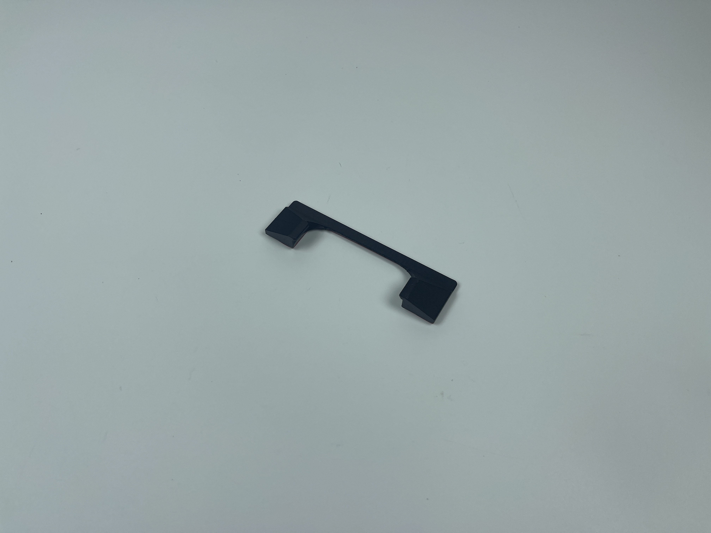
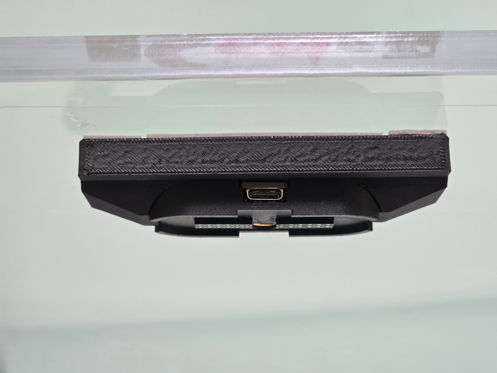
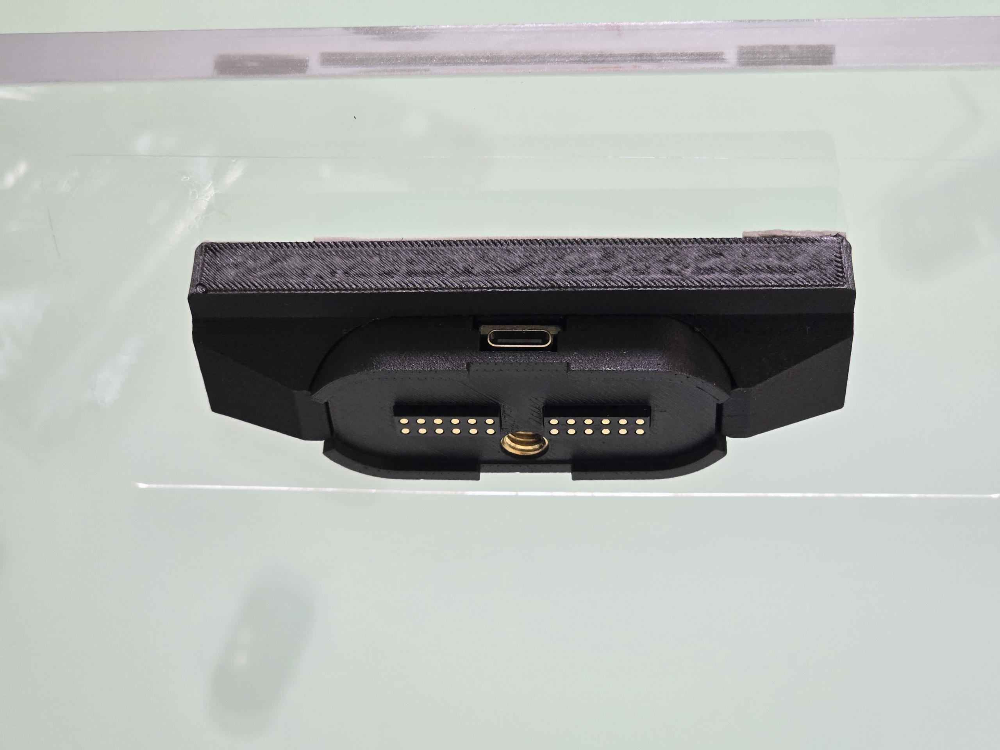
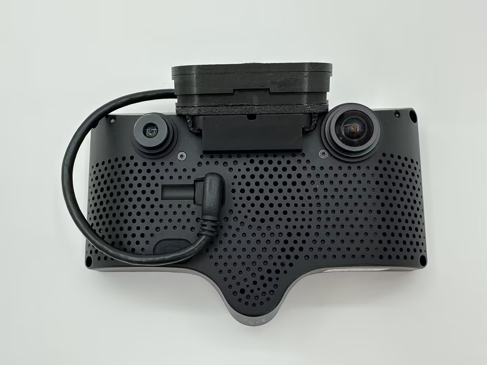
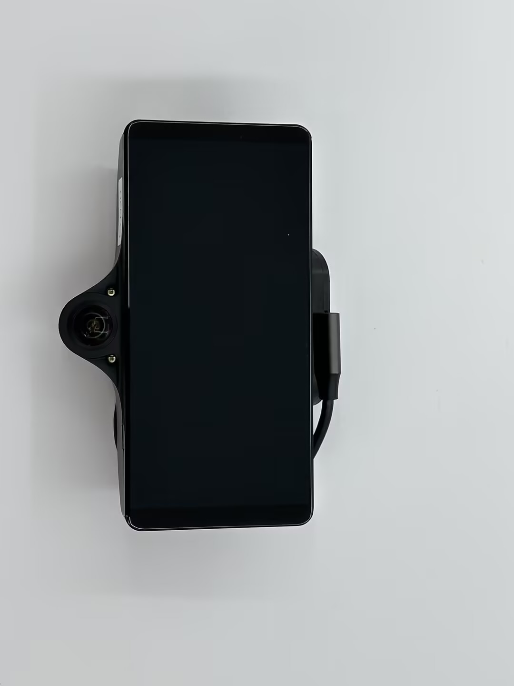
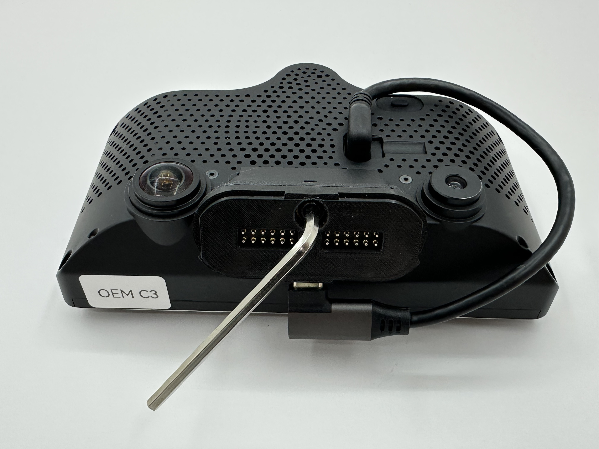

# Magmount Installation Guide - After 2025Aug1st

\*Disclaimer: This is a guide only.

**This installation guide applies to the magmount purchased after Aug 2025.** 

## **Set Screw Warning:**

#### **\*Over-tightening the set screw could break your magmount**

For magmount, set screw is **not required** unless you require extra tightness.\
\- **Do not over-tighten it**, as the screw is small and is only intended to prevent movement. \
Over-tightening it will **cause the breakage of the mounting bracket**

Only tighten the set screw if the mount is loose on your comma device. By design, the mount should be a very tight fit with your comma device, and it has been tested on both C3 and C3X.&#x20;

***

## Installation Steps

### Before installing the magmount, please find the description for each component in your package here:


[magmount-c3.md](magmount-c3.md)


### (Optional) Prepare your magmount: (ONLY if you redo the VHB)

1. Now, all magmount and angle wedge already come with **pre-applied VHB**. \
   If you would like to **redo the VHB**, then please follow the steps to prep it.\
   Please make sure you **apply the adhesion promoter** before applying the VHB.&#x20;
2. Warning: Apply the VHB tape to the magmount, angle wedges or comma mount adapter first before you stick it on the windshield. And apply the VHB in warm temp.\
   If you are reapplying the VHB tape, Clean the surface with isopropyl alcohol and ensure that no residue remains.
3. **(Important)** The ideal application temperature for VHB is above 70°F or 21°C. The minimum application temperature is 50°F and 10°C. If the temperature is lower than the minimum required, you can try to heat up the application area before and after attaching the magmount. Use common sense when heating the application area and avoid overheating or leaving it unattended. The VHB also need the above minimum required temperature for curing. Please leave it at least 24 hours or 1.5x the curing time recommended by 3M. Below is a snippet of recommended bond time from the 3M datasheet.
4. .png>)
5. Take the Windshield Side Mount and the Windshield Side Mount cover **(DO NOT open it up yet)**.
6. Wipe the back of the Windshield Side Mount with the IPA wipe.
7. **Apply adhesion promoter to every surface (except on glass)** that the VHB is going to stick to and let it dry. (If you have windshield tint, please try it on a small area first, some tint does not do well with the adhesion promoter)
8. Apply VHB tape to the Windshield Side Mount.
9. **Clamp or use weight** on the complete magmount for **at least 5 hours** so VHB makes perfect contact to the surface. **Every VHB-connected surface** needs to be clamped. (The complete magmount here means magount with VHB or the magmount with angle wedges and VHB or magmount with mount adapter sticked together. )

### Magmount Windshield and Device Side Installation Guide

1. Mark the **center position** where the Magmount will be installed

<figure><figcaption></figcaption></figure>

2. Use the Wet wipes **(VHB Tape pack)** to clean the marked area on the windshield inside the vehicle
3. Use the Dry wipes **(VHB Tape pack)** to further clean the same area on the windshield
4. Use the IPA wipes **(VHB Tape pack)** to thoroughly clean the marked area on the windshield
5. Apply the Static film **(VHB Tape pack)** to the windshield. **Note**: If your local weather exceed 40°C (104°F), avoid using the static film.
6. Take the Windshield Side Mount and the Windshield Side Mount cover **(DO NOT open it up yet)**.
7. See [#optional-prepare-your-magmount-only-if-you-redo-the-vhb](magmount-installation.md#optional-prepare-your-magmount-only-if-you-redo-the-vhb "mention")  applying VHB on Magmount. Remember to **clamp your mount** **and VHB** after you apply the VHB on the Magmount.
8. **(Important)** The ideal application temperature for VHB is above 70°F or 21°C. The minimum application temperature is 50°F and 10°C. If the temperature is lower than the minimum required, you can try to heat up the application area before and after attaching the magmount. Use common sense when heating the application area and avoid overheating or leaving it unattended. The VHB also need the above minimum required temperature for curing. Please leave it at least 24 hours or 1.5x the curing time recommended by 3M. Below is a snippet of recommended bond time from the 3M datasheet.\
   .png>)
9. If you are using an angle wedge, please **DO NOT DOUBLE LAYER the VHB** between the angle wedge and windshield mount. Double-layering might cause the mount to be unstable.\
   If there is VHB on both side of the angle wedge, peel one side off. And use adhesion promoter when attaching the windshield mount to the angle wedge.\
   So the setup should be: **VHB - Angle Wedge - VHB (Only one layer of VHB) - Windshield Mount**
10. If you decide to use the Comma Mount adapter, instead of redoing the VHB for winshield mount, please **DO NOT DOUBLE LAYER the VHB** between the comma mount adapter and windshield mount\
    If there is VHB on the Comma Mount Adapter, peel it off. And use adhesion promoter when attaching the windshield mount to the comma mount adapter.\
    The setup should be: **Comma Mount Adapter - VHB (Only one layer of VHB)- Windshield Mount**
11. Attach the Windshield Side Mount to the Static film if you applied it in step 5, or attach it to the windshield if the static film isn't applied. Try not to leave bubbles in VHB. Install it at a warm temperature and push firmly for optimal contact. During the time when VHB is curing, push firmly every hour to achieve optimal adhesion.&#x20;

<figure><figcaption></figcaption></figure>

10. Stick the magmount holder around the magmount and click it on. \
    Make sure it "holds" the magmounts on the sides.\
    This magmount holder will hold your magmount in place if the VHB peels off. It is unlikely that with the adhesive promoter applied, the VHB still peels off from the magmount; but the holder acts as a last line of defence.

    **0° Magmount Holder Installation:**

    
<figure><figcaption></figcaption></figure> <figure><figcaption></figcaption></figure>

    **8° Magmount Holder Installation:**

    
<figure><figcaption></figcaption></figure> <figure><figcaption></figcaption></figure>

11. Connect the 45cm Type-C cable to the Windshield Side Mount
12. Connect the other side of the Type C cable to the harness box. Use the cable organizers **(Optional)** to tidy up the cable if needed.

<figure><figcaption></figcaption></figure>

13. Take the Device Side Mount and slide it onto the Comma Device\
    \*\*There is a galvanized steel plate added to reduce the magnetic field. It might cause scratches on your Comma device. \
    If you **do not encounter a "Fan malfunction" issue** while using the magmount, the galvanized steel plate is **not a mandatory part**; you can remove the galvanized steel plate before installing the Device Side Mount (warning: the plate could be very sharp on the edges)\
    The steel plate on the device mount shown in the picture below is the galvanized steel plate. It is stuck on the magmount by magnets and can be removed easily.

<figure><figcaption></figcaption></figure>

13. Use the 13cm Type C cable to connect the Device Side Mount to the Comma Device

<figure><figcaption></figcaption></figure> <figure><figcaption></figcaption></figure>

14. _**For Magmount set screw instructions, Magmount Warning**_: (Set screw is **optional** for Magmount) Only tighten the set screw if the mount is loose on your comma device. \
    By design, the mount should be a very tight fit with your comma device, and it has been tested on both C3 and C3X. \
    The set screw is there if you are using a comma clone device and the mount is loose on your device. \
    \
    Use the Allen Key to tighten the set screw on the Device Side Mount\
    **Please do not over-tighten it**, as the screw is only intended to prevent movement. \
    Over-tightening it will cause the breakage of the mounting bracket

<figure><figcaption></figcaption></figure>

15. Tighten it just enough that there is a gap between the mount and the device. Make sure this line is **straight, not curved** when you tighten the set screw.

<figure><figcaption></figcaption></figure>

16. Carefully remove the Windshield Side Mount Cover and attach the Device Side Mount to the Windshield Side Mount. **Be cautious,** as the magnet is very strong and can pinch your fingers.
17. &#x20;Use the bubble level **(Optional)** to ensure the Comma Device is level

<figure><figcaption></figcaption></figure>

22. Use the Tilt Level meter (**Optional**) to confirm proper installation.\
    If it is not level, then an angle wedge might be needed.&#x20;

<figure><figcaption></figcaption></figure>

23. The installation process is complete. Please wait for VHB to cure, and you are all set.

<figure><figcaption></figcaption></figure>

24. Please keep the Windshield Side Mount Cover for future use. Reattach it after removing the Comma Device to prevent short-circuiting the mount.

### Magmount Dummy Side Installation Guide

1. Choose a location to store your Comma Device.
2. Clean the surface using the Wet & Dry Wipes and IPA Wipes **(VHB Tape pack)**.
3. If attaching to a window or glass surface, you may use a static film. For other surfaces, use it with the adhesion promoter **(adhesion promoter pack)**.
4. Stick the Dummy Side Mount on the surface with the pre-applied VHB.
5. Now you can use the Dummy Mount to securely store your Comma Device when it’s not in use!

***

## Why & When to use the cover (and Cover B) for magmount?

**Windshield Mount Cover** (Between your windshield mount and device mount)

This cover is designed for the windshield mount. We recommend putting it on **every time** you remove the mount to:

* **Prevent condensation**, especially in cold climates (like here in Canada!), where temperature differences can cause moisture buildup.
* **Avoid short circuits**, especially if the windshield is cleaned with a damp cloth or during interior detailing. If you don’t want to use it every time, at least cover it when doing a car wash or deep clean.

**Cover B** (Included in the Accessory Pack)

Cover B is a flexible cover that can be used on **either the windshield mount or the device mount**.

* If you lose the original windshield cover, Cover B can be used as a backup.
* For the **device mount**, we strongly recommend using Cover B when not in use, since the exposed **pogo pins** (electrical contacts) can:
  * Lead to accidental **shorting**
  * Cause **physical damage** during transport or if it bumps against other surfaces

If you're using a dummy mount or storing it in the carry case, Cover B isn’t necessary. Otherwise, it's a good habit to cover it up when not connected to the device.

***

## Warnings and Cautions

1. Magnets:
   1. Warning: The strong magnets in this product can cause severe pinching injuries. Always handle with care and avoid placing fingers near the magnetic connection points. Do not play with the magnets, as they can attract unexpectedly and lead to injury.
   2. Caution: Keep all magnetic components away from electronic devices, credit cards, and other magnetic-sensitive materials. Failure to do so may result in damage to these items.
   3. Caution: Store the device away from children and pets to prevent accidental injury or ingestion.
2. Adhesion Promoter:
   1. Warning: Keep out of reach of children. Always use provided gloves during application. This product is highly flammable; keep away from heat sources and open flames. Causes serious eye irritation and may result in an allergic skin reaction. It may be fatal if swallowed and enters airways. May cause drowsiness or dizziness, and has potential reproductive effects. Long-term exposure may damage sensory organs and the nervous system.
3. Type-C Cables:
   1. Warning: Keep out of reach of children. Do not pull the cable with excessive force, and ensure the cable is firmly attached to prevent damage.
4. VHB Tape:
   1. Warning: Keep out of reach of children.
   2. Caution: Ensure the bonding surface is clean and dry before applying the VHB tape for optimal adhesion.
5. Thread Locker:
   1. Warning: Keep out of reach of children.
   2. Hazard Statements: Causes serious eye irritation and may cause an allergic skin reaction.
6. Static Cling Film:
   1. Warning: Keep out of reach of children.

#### General Safety

* Caution: Always follow the installation instructions carefully. Improper installation may lead to device malfunction, damage to your vehicle, or personal injury.
* Caution: Ensure that the mount is securely attached before driving. Regularly check for any signs of wear or loosening.
* Warning: Do not overload the mount or exceed the weight limit of the device. This could cause the mount to detach unexpectedly while in use.
* Caution: Avoid using the device in extreme weather conditions (e.g., excessive heat or cold) that may affect its performance and adhesion.
* Caution: Be aware of your surroundings when installing or removing the mount to prevent accidents or injuries.

#### Liability Disclaimer

Warning: The manufacturer is not responsible for any injuries, damages, or malfunctions resulting from improper installation, use, or handling of this product. Use at your own risk.
