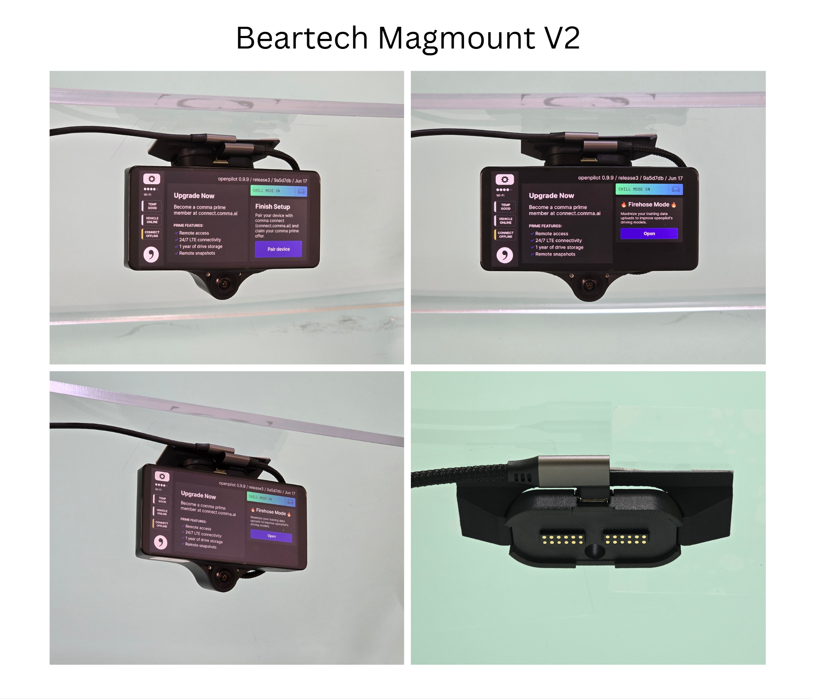
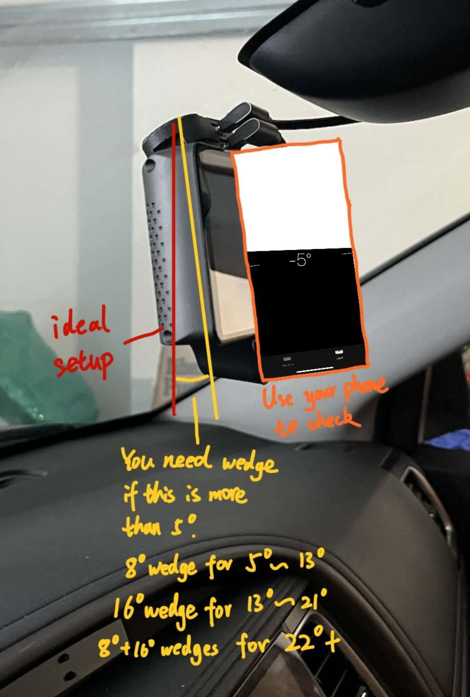
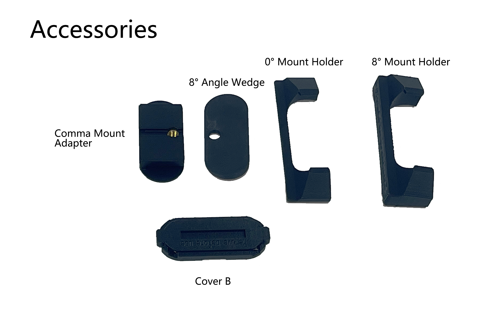

# Magmount Description

## Description:

The Magmount is your go-to magnetic mount for the comma device, featuring 24 pogo pins for a full-feature Type-C connection and optimized internal wiring for top-notch signal quality. It’s super slim at just 17mm and includes a handy 1/4-inch thread for camera tripods, making it both functional and versatile. Plus, with concerns about smash-and-grab thefts on the rise, it comes with a dummy mount that lets you securely stash your device under the dash, keeping it hidden and cool. Just grab it and attach it to the windshield as you get in—no more fussing around with glove boxes or center consoles!

<figure><figcaption></figcaption></figure>

## Where to buy:

Link to my Store:

Magmount Premium Set & Angle Wedge & Mount Adapter & More: [https://shop.tlbb.ca/products/openpilot-magmount-magnetic-mount-set-for-comma-device](https://shop.tlbb.ca/products/openpilot-magmount-magnetic-mount-set-for-comma-device)

Link to my Etsy Store:

[https://www.etsy.com/ca/listing/1804507729/beartech-magmount-openpilot-magnetic](https://www.etsy.com/ca/listing/1804507729/beartech-magmount-openpilot-magnetic)

Link to RetroPilot Store:

[https://shop.retropilot.org/product/beartech-magmount](https://shop.retropilot.org/product/beartech-magmount)

### 🚨 Update for V2 Magmount Se&#x74;**:**&#x20;

**Magmount V2** is **now available!** — heat-tested, screw-fastened, fan-safe, stronger hold (plus a travel rack option)

After 11 months of feedback and **hundreds of hours of 65–85 °C soak + heat-cycle testing**, Magmount V2 is ready. We listened, broke things, fixed them, and iterated until it sticks (literally). Huge thanks to everyone who waited and sent detailed reports—you shaped V2.&#x20;

**What’s new vs V1 (quick hits):**

* **Sticks better:** Thicker 3M VHB for curved windshields + **pre-applied VHB** on the windshield mount side. **Adhesion promoter kit** included. Included **Magmount holder** acts like last line of defense, hold your Magmount in place.
* **No more glue failures:** Device mount is now **mechanically fastened** with **6 heat-set inserts + screws** near the bracket for even load. Survived \~**1 week at 85 °C** in chamber tests.
* **New C3X Fan friendly:** Added a **galvanized steel shield** between magnet and device to cut magnetic field \~**80%**—addresses the C3X slow-fan concern. _**(Optional to use, if you do not want it, you can remove it)**_
* **Stronger hold:** Larger magnet = about **+50%** total magnetic strength.
* **Tough cabling:** Upgraded to a **braided cable** for better wear resistance.
* **Simpler buying:** One kit, **all accessories included** (no more tier confusion).

**Options if magnets aren’t your thing:**\
We also built a **Slidemount** (a sliding quick mount) that locks mechanically.\
[https://shop.tlbb.ca/products/beartech-slidemount](https://shop.tlbb.ca/products/beartech-slidemount)

**Travel / no-VHB?**\
Our **Suction Rack** works with Magmount—perfect for tinted windshields, rentals, road trips, or anyone who doesn’t want adhesive on glass.\
[https://shop.beartech.ca/products/suction-rack](https://shop.beartech.ca/products/suction-rack)

**Support & thanks:**\
We’ve already sent replacement device mounts to folks who reported V1 splitting. If we missed you, DM us (or reply to your order email) and we’ll make it right. Thanks again for sticking with us—V2 exists because of you. 🙏

**How to get customer service for the product issue:**\
Question of setting it up?\
\- Documentation: https://docs.innoisle.com/\
\- Discord: https://discord.innoisle.com/\
Product defect warranty and help request:\
\- Email us at \`info@beartech.ca\` If you purchased from \`shop.tlbb.ca\` or \`shop.beartech.com\`.\
\- Send us a message on Etsy with your order number if you purchased from our Etsy store.

&#x20;

## Installation Guide:

**New Installation guide** for Magmount purchased **after August 2025**


[magmount-installation.md](magmount-installation.md)


**Old Installation guide** fo Magmount purchased **before August 2025**


[magmount-installation-1.md](magmount-installation-1.md)


***

## Magmount Premium Kit

<figure><figcaption></figcaption></figure> <figure><figcaption></figcaption></figure>

**What is included in the Magmount Premium Set**:

* Device Side Mount x1  (Mount Set) - With Magnetic Shield
* Windshield Side Mount x1  (Mount Set) - With VHB pre-applied
* Mount Cover x1  (Mount Set)
* Dummy Mount x1  (Mount Set)
* 8 degree Angle Wedge x1  (Accessories) - With VHB pre-applied
* Magmount Holder (0 degree and 8 degree)  x1   (Accessories) - With VHB pre-applied
* Comma Mount Adapter x1  (Accessories)
* Magmount Cover B x1  (Accessories)
* 45cm Type C Cable x1  (Cable Set)
* 13cm Type C Cable x1  (Cable Set)
* Wet & DryWipe x4  (2 VHB Pack)
* IPA Wipe X4  (2 VHB Pack)
* 3M VHB Tape x4  (2 VHB Pack)
* Static Film x4  (2 VHB Pack)
* Adhesion Promoter Wipe X4  (Adhesion Promoter Pack)
* PE gloves X2  (Adhesion Promoter Pack)
* Allen Key x1  (Set Screw Pack)
* Set Screw x1  (Set Screw Pack)
* Device Mount Bracket x1 (Replacement Parts)
* Phillips screwdriver x1  (Replacement Parts)
* Phillips screw x2  (Replacement Parts)

## What is a Dummy mount?

A: Depends on your use case. Premium has one **dummy mount** that offer a way to mount your device under dash or steering wheel when you car is in park. Potential thief can’t see what’s under the steering wheel or under dash from peeking over the window.\
Premium also has more mounting accessories that help make the mount stick better.\
There is no circuitry inside the dummy mount. You can **only hang your device for storage**.

I wrote this one Reddit, and this is the reason why we have a dummy mount:\
The Magnetic mount solution from the community doesn't address this issue very well. I'm too lazy to store it in the glove box or the center console. Think about the process: You have to go into your glove box, reach for the device, take it out of the box if you don't want to scratch it, reach over the windshield, and mount it every time you enter the car. That's too much work!\
This got me thinking, and I came up with a solution. In the premium set, I included a dummy mount. You can stick the dummy mount under the dash and then attach your device to it for storage. When you enter the car, grab your device and attach it to the real mount on the windshield before you even sit.\
You still get everything you need from Essential if you just need a quick-mount. The Beartech Magmount is a clean and tidy solution for storing it, hiding away from thieves, and no more overheating when you start the car because the foot well area is colder and away from the sun.



## What sets it apart from other Magnetic mount solutions:

1. 24 pogo pins enable full-feature type-c connections.
2. The internal data connection pair is length-matched for better signal transmission.
3. 8 pogo pins are dedicated to the power rail.
4. 17mm total thickness, slimmer design.
5. Gold-plated pogo pin and type-c cable.
6. Built-in 1/4-inch thread fits with the camera tripod screw.
7. Reversible mount orientation (only one orientation is recommended for openpilot use).
8. Windshield mount cover to avoid short circuit.
9. A dummy mount is used to hide your device under the dashboard in the premium set.
10. A built-in pull tab is on the side for ease of use.
11. 45N splitting force for the comfort of use without worry about unexpected disconnect.&#x20;
12. 10k cycles of torture test passed.
13. Run over bump test passed.
14. -20°C/-4°F Freezer test passed (incoming Canadian winter test).
15. 12V 3Amp high power temperature test passed.

#### Vehicles that require Angle Wedge **(only based on limited user feedback)** **If you are using an angle wedge for the original comma mount setup, then you will also need one for your magmount:**

* Toyota Highlander (8 degree)
* Honda Pilot (8 degree)
* Ford F150 (8 degree)
* Ford Maverick (8 degree)
* Rivian Truck & SUV  (8 degree)
* Ram 1500  (8 degree)
* And any windshield that makes your comma device tilt more than 5 degree

<figure><figcaption></figcaption></figure>

***

## Add-ons

If you still wish to protect your Comma device, we have our **storage case**.&#x20;


[carry-case-for-c3-c3x.md](carry-case-for-c3-c3x.md)


The **Magmount** will  include all the additional accessories that you might need. \
But if you want additional parts such as the **Angle Wedge**, **Comma Mount Adapter**, **OP Device Stand,** and **Suction Rack,** they are shared between the **Magmount** and **Slidemount**.

You can find them at:

OP Device Stand: [https://shop.tlbb.ca/products/op-device-stand](https://shop.tlbb.ca/products/op-device-stand)

Suction Rack: [https://shop.beartech.ca/products/suction-rack](https://shop.beartech.ca/products/suction-rack)

Magmount and accessories (angle wedge, Comma Mount Adapter): [ttps://shop.tlbb.ca/products/openpilot-magmount-magnetic-mount-set-for-comma-device](https://shop.tlbb.ca/products/openpilot-magmount-magnetic-mount-set-for-comma-device)

***

## Detailed Parts Description

### Magmount Kits

#### **What is included:**

1. **Magmount Set:**

<figure><figcaption></figcaption></figure>

\- Magmount Device Side Mount x1\
\- Magmount Windshield Side Mount x1\
\- Windshield Mount Cover x1\
(Prevent short-circuiting after the device is pulled off)

2. **Dummy Mount x1**

<figure><figcaption></figcaption></figure>

3. **Type C pack:**

<figure><figcaption></figcaption></figure>

\- 13cm Right Angle Head Type-C to Right Angle Head Type-C Cable (Connect the comma device and the Device Side Mount)\
\- 45cm Right Angle Head Type-C to Stright Type-C Cable (Connect harness box and the Windshield Side Mount)

4. **Accessories**

<figure><figcaption></figcaption></figure>

\- 0° Mount Holder x1\
\- 8° Mount Holder x1\
\- 8° Angle Wedge x1\
\- Comma Mount Adapter x1\
\- Cover B x1\

5. **VHB Tape pack X2:**

<figure><figcaption></figcaption></figure>

\- Cut to size 3M VHB Tape x4 (Stick the Windshield Side Mount to Car Windshield)\
\- Wet & Dry wipes x4 (Clean the windshield before apply)\
\- IPA wipe x4 (Clean the windshield before apply)\
\- Static film x4 (Stick to the windshield before sticking the VHB tape for easy removal in the future ONLY stick to glass (no tint on the windshield). If the temperature in your area is above 40C (or 104F), static film is not recommended)

6. **Adhesion Promoter pack:**

<figure><figcaption></figcaption></figure>

\- Adhesion Promoter Wipe x4 (Enhance adhesion for non-glass surfaces, adhesion for dummy mount)\
\- PE gloves x2

7. **Set Screw Kit**\
   (**Do not over-tighten it**, as the screw is small and is only intended to prevent movement)

\- Allen Key x1\
\- Set Screw x2

<figure><figcaption></figcaption></figure>

8. **Replacement Kit**

<figure><figcaption></figcaption></figure>

\- Phillips Screwdriver x1\
\- Phillips Screw x2\
\- Device Mount Replacement Bracket Part x1

***

### Magmount Add-ons (single mounts)

#### What is included in the Windshield Magmount:

<figure><figcaption></figcaption></figure>

1. Magmount Set Pack:\
   \- Windshield Side Mount x1\
   \- Windshield Mount Cover x1\
   (Prevent short-circuiting after the device is pulled off)

<figure><figcaption></figcaption></figure>

2. Type C pack:\
   \- 45cm Right Angle Head Type-C to Stright Type-C Cable\
   (Connect harness box and the Windshield Side Mount)

<figure><figcaption></figcaption></figure>

3. VHB Tape pack:\
   \- Cut to size 3M VHB Tape x2 (Stick the Windshield Side Mount to Car Windshield)\
   \- Wet & Dry wipes x2 (Clean the windshield before apply)\
   \- IPA wipe x2 (Clean the windshield before apply)\
   \- Static film x2 (Stick to the windshield before sticking the VHB tape for easy removal in the future ONLY stick to glass (no tint on the windshield). If the temperature in your area is above 40C (or 104F), static film is not recommended)

<figure><figcaption></figcaption></figure>

#### **What is included in the Dummy Windshield Mount:**

<figure><figcaption></figcaption></figure>

1. Dummy Magmount windshield side x1

<figure><figcaption></figcaption></figure>

2. VHB Tape pack:\
   \- Cut to size 3M VHB Tape x2 (Stick the Windshield Side Mount to Car Windshield)\
   \- Wet & Dry wipes x2 (Clean the windshield before apply)\
   \- IPA wipe x2 (Clean the windshield before apply)\
   \- Static film x2 (Stick to the windshield before sticking the VHB tape for easy removal in the future ONLY stick to glass (no tint on the windshield). If the temperature in your area is above 40C (or 104F), static film is not recommended)

<figure><figcaption></figcaption></figure>

#### **What is included in the Magmount Angle Wedge:**

<figure><figcaption></figcaption></figure>

1. 8 degree mount

<figure><figcaption></figcaption></figure>

2. 16 degree mount

<figure><figcaption></figcaption></figure>

3. VHB Tape pack:\
   \- Cut to size 3M VHB Tape x2 (Stick the Windshield Side Mount to Car Windshield)\
   \- Wet & Dry wipes x2 (Clean the windshield before apply)\
   \- IPA wipe x2 (Clean the windshield before apply)\
   \- Static film x2 (Stick to the windshield before sticking the VHB tape for easy removal in the future ONLY stick to glass (no tint on the windshield). If the temperature in your area is above 40C (or 104F), static film is not recommended)

<figure><figcaption></figcaption></figure>

**What is included in the Comma Mount Adapter:**

<figure><figcaption></figcaption></figure>

1. Comma Mount Adapter

<figure><figcaption></figcaption></figure>

<figure><figcaption></figcaption></figure>

2. VHB Tape pack:\
   \- Cut to size 3M VHB Tape x2 (Stick the Windshield Side Mount to Car Windshield)\
   \- Wet & Dry wipes x2 (Clean the windshield before apply)\
   \- IPA wipe x2 (Clean the windshield before apply)\
   \- Static film x2 (Stick to the windshield before sticking the VHB tape for easy removal in the future ONLY stick to glass (no tint on the windshield). If the temperature in your area is above 40C (or 104F), static film is not recommended)

<figure><figcaption></figcaption></figure>

#### **What is included in the Magmount Cover B**

Many users requested the Magmount Cover B to either replace the lost original windshield mount cover or cover the device magmount.

The new Magmount Cover is compatible on both sides. It can be a cover for either windshield mount or device mount after taking them apart.

If you would like to cover BOTH windshield mount AND device mount SEPARATELY, please purchase 2.

<figure><figcaption></figcaption></figure>

1. Magmount Cover B

<figure><figcaption></figcaption></figure>

## Development Roadmaps

Learn about the development process and tests we have done.


[bear-tech-product-development-road-map-and-progress-tracker.md](bear-tech-product-development-road-map-and-progress-tracker.md)


## Warnings and Cautions

1. Magnets:
   1. Warning: The strong magnets in this product can cause severe pinching injuries. Always handle with care and avoid placing fingers near the magnetic connection points. Do not play with the magnets, as they can attract unexpectedly and lead to injury.
   2. Caution: Keep all magnetic components away from electronic devices, credit cards, and other magnetic-sensitive materials. Failure to do so may result in damage to these items.
   3. Caution: Store the device away from children and pets to prevent accidental injury or ingestion.
2. Adhesion Promoter:
   1. Warning: Keep out of reach of children. Always use provided gloves during application. This product is highly flammable; keep away from heat sources and open flames. Causes serious eye irritation and may result in an allergic skin reaction. It may be fatal if swallowed and enters airways. May cause drowsiness or dizziness, and has potential reproductive effects. Long-term exposure may damage sensory organs and the nervous system.
3. Type-C Cables:
   1. Warning: Keep out of reach of children. Do not pull the cable with excessive force, and ensure the cable is firmly attached to prevent damage.
4. VHB Tape:
   1. Warning: Keep out of reach of children.
   2. Caution: Ensure the bonding surface is clean and dry before applying the VHB tape for optimal adhesion.
5. Thread Locker:
   1. Warning: Keep out of reach of children.
   2. Hazard Statements: Causes serious eye irritation and may cause an allergic skin reaction.
6. Static Cling Film:
   1. Warning: Keep out of reach of children.

#### General Safety

* Caution: Always follow the installation instructions carefully. Improper installation may lead to device malfunction, damage to your vehicle, or personal injury.
* Caution: Ensure that the mount is securely attached before driving. Regularly check for any signs of wear or loosening.
* Warning: Do not overload the mount or exceed the weight limit of the device. This could cause the mount to detach unexpectedly while in use.
* Caution: Avoid using the device in extreme weather conditions (e.g., excessive heat or cold) that may affect its performance and adhesion.
* Caution: Be aware of your surroundings when installing or removing the mount to prevent accidents or injuries.

#### Liability Disclaimer

Warning: The manufacturer is not responsible for any injuries, damages, or malfunctions resulting from improper installation, use, or handling of this product. Use at your own risk.
