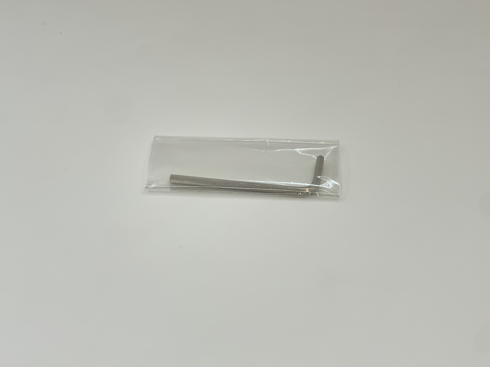
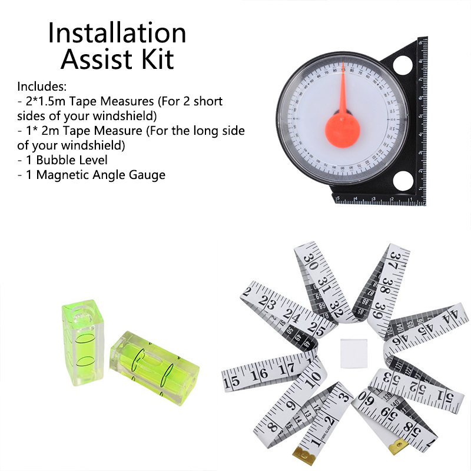
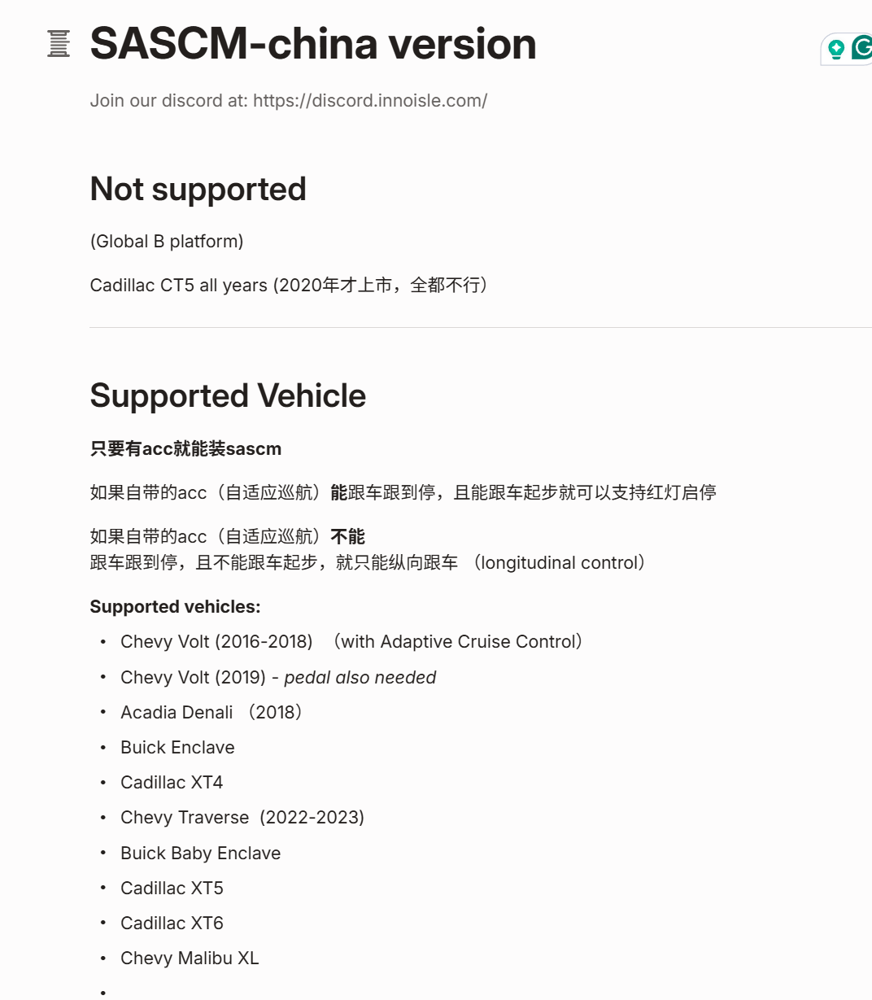

# Magmount Description

## Description:

The Magmount is your go-to magnetic mount for the comma device, featuring 24 pogo pins for a full-feature Type-C connection and optimized internal wiring for top-notch signal quality. It’s super slim at just 17mm and includes a handy 1/4-inch thread for camera tripods, making it both functional and versatile. Plus, with concerns about smash-and-grab thefts on the rise, our premium set comes with a dummy mount that lets you securely stash your device under the dash, keeping it hidden and cool. Just grab it and attach it to the windshield as you get in—no more fussing around with glove boxes or center consoles!

## Where to buy:

Magmount Essential Kit and Premium Kit: [https://shop.tlbb.ca/products/openpilot-magmount-magnetic-mount-set-for-comma-device](https://shop.tlbb.ca/products/openpilot-magmount-magnetic-mount-set-for-comma-device)

Magmount Add-on Mounts: [https://shop.tlbb.ca/products/openpilot-magmount-magnetic-mount-add-on-for-comma-device](https://shop.tlbb.ca/products/openpilot-magmount-magnetic-mount-add-on-for-comma-device)

***

## Essential Kit VS Premium Kit

| Magmount Essential             | Magmount Premium               |
| ------------------------------ | ------------------------------ |
| Device Side Mount x1           | Device Side Mount x1           |
| Windshield Side Mount x1       | Windshield Side Mount x1       |
| Windshield Side Mount Cover x1 | Windshield Side Mount Cover x1 |
| 13cm Type C Cable x1           | 13cm Type C Cable              |
| 45cm Type C Cable x1           | 45cm Type C Cable x1           |
| 3M VHB Tape x2                 | 3M VHB Tape x4                 |
| Wet & DryWipe x2               | Wet & DryWipe x4               |
| IPA Wipe X2                    | IPA Wipe X4                    |
| Static Film x2                 | Static Film x4                 |
|                                | Allen Key x1                   |
|                                |                                |
|                                | Dummy Mount x1                 |
|                                | Adhesion Promoter Wipe X2      |
|                                | PE gloves X2                   |
|                                | Threadlocker x1                |
|                                | Set Screw x1                   |

## What sets it apart from other Magnetic mount solutions:

1. 24 pogo pins enable full-feature type-c connections.
2. The internal data connection pair is length-matched for better signal transmission.
3. 8 pogo pins are dedicated to the power rail.
4. 17mm total thickness, slimmer design.
5. Gold-plated pogo pin and type-c cable.
6. Built-in 1/4-inch thread fits with the camera tripod screw.
7. Reversible mount orientation (only one orientation is recommended for openpilot use).
8. Windshield mount cover to avoid short circuit.
9. A dummy mount is used to hide your device under the dashboard in the premium set.
10. A built-in pull tab is on the side for ease of use.
11. 45N splitting force for the comfort of use without worry about unexpected disconnect.&#x20;
12. 10k cycles of torture test passed.
13. Run over bump test passed.
14. -20°C/-4°F Freezer test passed (incoming Canadian winter test).
15. 12V 3Amp high power temperature test passed.

#### Vehicles that require Angle Wedge:

* Toyota Highlander (8 degree)
* Ford F150 (8 degree)
* And any windshield that makes your comma device tilt more than 5 degree

<figure><figcaption></figcaption></figure>

## Product Description

### Magmount Kits

#### **What is included in Magmount Essential:**

<figure><figcaption></figcaption></figure> <figure><figcaption></figcaption></figure>

**Magmount Set A:**\
1\. Magmount Set Pack:\
\- Device Side Mount x1\
\- Windshield Side Mount x1\
\- Windshield Mount Cover x1\
(Prevent short-circuiting after the device is pulled off)

<figure><figcaption></figcaption></figure>

2. Type C pack:\
   \- 13cm Right Angle Head Type-C to Right Angle Head Type-C Cable (Connect the comma device and the Device Side Mount)\
   \- 45cm Right Angle Head Type-C to Stright Type-C Cable (Connect harness box and the Windshield Side Mount)

<figure><figcaption></figcaption></figure>

3. VHB Tape pack:\
   \- Cut to size 3M VHB Tape x2 (Stick the Windshield Side Mount to Car Windshield)\
   \- Wet & Dry wipes x2 (Clean the windshield before apply)\
   \- IPA wipe x2 (Clean the windshield before apply)\
   \- Static film x2 (Stick to the windshield before sticking the VHB tape for easy removal in the future ONLY stick to glass (no tint on the windshield). If the temperature in your area is above 40C (or 104F), static film is not recommended)

<figure><figcaption></figcaption></figure>

#### **What is included in Magmount Premium:**

<figure><figcaption></figcaption></figure> <figure><figcaption></figcaption></figure>

**Magmount Premium includes everything in Magmount Essential, Plus Magmount Set B:**

1. Dummy Magmount windshield side x1

<figure><figcaption></figcaption></figure>

2. VHB Tape pack:\
   \- Cut to size 3M VHB Tape x2 (Stick the Windshield Side Mount to Car Windshield)\
   \- Wet & Dry wipes x2 (Clean the windshield before apply)\
   \- IPA wipe x2 (Clean the windshield before apply)\
   \- Static film x2 (Stick to the windshield before sticking the VHB tape for easy removal in the future ONLY stick to glass (no tint on the windshield). If the temperature in your area is above 40C (or 104F), static film is not recommended)

<figure><figcaption></figcaption></figure>

3. Adhesion Promoter pack:\
   \- Adhesion Promoter Wipe x2 (Enhance adhesion for non-glass surfaces, adhesion for dummy mount)\
   \- PE gloves x2

<figure><figcaption></figcaption></figure>

4. Threadlocker x1\
   (Prevents loosening of set screw in Device Side Mount)

<figure><figcaption></figcaption></figure>

5. Allen Key x1 (Adjust set screw)

<figure><figcaption></figcaption></figure>

&#x20;**What is included in the Installation kit (for Magmount Premium pre-orders ONLY):**

<figure><figcaption></figcaption></figure>

1\.     1.5m Tape Measure x2

2\.     2m Tape Measure x2

3\.     Bubble Level x1

4\.     Magnetic angle gauge x1

5\.     Cable organizers

***

### Magmount Add-ons (single mounts)

#### What is included in the Windshield Magmount:

<figure><figcaption></figcaption></figure>

1. Magmount Set Pack:\
   \- Windshield Side Mount x1\
   \- Windshield Mount Cover x1\
   (Prevent short-circuiting after the device is pulled off)

<figure><figcaption></figcaption></figure>

2. Type C pack:\
   \- 45cm Right Angle Head Type-C to Stright Type-C Cable\
   (Connect harness box and the Windshield Side Mount)

<figure><figcaption></figcaption></figure>

3. VHB Tape pack:\
   \- Cut to size 3M VHB Tape x2 (Stick the Windshield Side Mount to Car Windshield)\
   \- Wet & Dry wipes x2 (Clean the windshield before apply)\
   \- IPA wipe x2 (Clean the windshield before apply)\
   \- Static film x2 (Stick to the windshield before sticking the VHB tape for easy removal in the future ONLY stick to glass (no tint on the windshield). If the temperature in your area is above 40C (or 104F), static film is not recommended)

<figure><figcaption></figcaption></figure>

#### **What is included in the Device Magmount:**

<figure><figcaption></figcaption></figure>

1. Magmount Set Pack:\
   \- Device Side Mount x1

<figure><figcaption></figcaption></figure>

2. Type C pack:\
   \- 13cm Right Angle Head Type-C to Right Angle Head Type-C Cable\
   (Connect the comma device and the Device Side Mount)

<figure><figcaption></figcaption></figure>

#### **What is included in the Dummy Windshield Mount:**

<figure><figcaption></figcaption></figure>

1. Dummy Magmount windshield side x1

<figure><figcaption></figcaption></figure>

2. VHB Tape pack:\
   \- Cut to size 3M VHB Tape x2 (Stick the Windshield Side Mount to Car Windshield)\
   \- Wet & Dry wipes x2 (Clean the windshield before apply)\
   \- IPA wipe x2 (Clean the windshield before apply)\
   \- Static film x2 (Stick to the windshield before sticking the VHB tape for easy removal in the future ONLY stick to glass (no tint on the windshield). If the temperature in your area is above 40C (or 104F), static film is not recommended)

<figure><figcaption></figcaption></figure>

#### **What is included in the Magmount Angle Wedge:**

<figure><figcaption></figcaption></figure>

1. 8 degree mount

<figure><figcaption></figcaption></figure>

2. 16 degree mount

<figure><figcaption></figcaption></figure>

3. VHB Tape pack:\
   \- Cut to size 3M VHB Tape x2 (Stick the Windshield Side Mount to Car Windshield)\
   \- Wet & Dry wipes x2 (Clean the windshield before apply)\
   \- IPA wipe x2 (Clean the windshield before apply)\
   \- Static film x2 (Stick to the windshield before sticking the VHB tape for easy removal in the future ONLY stick to glass (no tint on the windshield). If the temperature in your area is above 40C (or 104F), static film is not recommended)

<figure><figcaption></figcaption></figure>

**What is included in the Comma Mount Adapter:**

<figure><figcaption></figcaption></figure>

1. Comma Mount Adapter

<figure><figcaption></figcaption></figure>

<figure><figcaption></figcaption></figure>

2. VHB Tape pack:\
   \- Cut to size 3M VHB Tape x2 (Stick the Windshield Side Mount to Car Windshield)\
   \- Wet & Dry wipes x2 (Clean the windshield before apply)\
   \- IPA wipe x2 (Clean the windshield before apply)\
   \- Static film x2 (Stick to the windshield before sticking the VHB tape for easy removal in the future ONLY stick to glass (no tint on the windshield). If the temperature in your area is above 40C (or 104F), static film is not recommended)

<figure><figcaption></figcaption></figure>

#### **What is included in the Magmount Cover B**

Many users requested the Magmount Cover B to either replace the lost original windshield mount cover or cover the device magmount.

The new Magmount Cover is compatible on both sides. It can be a cover for either windshield mount or device mount after taking them apart.

If you would like to cover BOTH windshield mount AND device mount SEPARATELY, please purchase 2.

<figure><figcaption></figcaption></figure>

1. Magmount Cover B

<figure><figcaption></figcaption></figure>

## Development Roadmaps

Learn about the development process and tests we have done.


[publish-your-docs.md](publish-your-docs.md)


## Warnings and Cautions

1. Magnets:
   1. Warning: The strong magnets in this product can cause severe pinching injuries. Always handle with care and avoid placing fingers near the magnetic connection points. Do not play with the magnets, as they can attract unexpectedly and lead to injury.
   2. Caution: Keep all magnetic components away from electronic devices, credit cards, and other magnetic-sensitive materials. Failure to do so may result in damage to these items.
   3. Caution: Store the device away from children and pets to prevent accidental injury or ingestion.
2. Adhesion Promoter:
   1. Warning: Keep out of reach of children. Always use provided gloves during application. This product is highly flammable; keep away from heat sources and open flames. Causes serious eye irritation and may result in an allergic skin reaction. It may be fatal if swallowed and enters airways. May cause drowsiness or dizziness, and has potential reproductive effects. Long-term exposure may damage sensory organs and the nervous system.
3. Type-C Cables:
   1. Warning: Keep out of reach of children. Do not pull the cable with excessive force, and ensure the cable is firmly attached to prevent damage.
4. VHB Tape:
   1. Warning: Keep out of reach of children.
   2. Caution: Ensure the bonding surface is clean and dry before applying the VHB tape for optimal adhesion.
5. Thread Locker:
   1. Warning: Keep out of reach of children.
   2. Hazard Statements: Causes serious eye irritation and may cause an allergic skin reaction.
6. Static Cling Film:
   1. Warning: Keep out of reach of children.

#### General Safety

* Caution: Always follow the installation instructions carefully. Improper installation may lead to device malfunction, damage to your vehicle, or personal injury.
* Caution: Ensure that the mount is securely attached before driving. Regularly check for any signs of wear or loosening.
* Warning: Do not overload the mount or exceed the weight limit of the device. This could cause the mount to detach unexpectedly while in use.
* Caution: Avoid using the device in extreme weather conditions (e.g., excessive heat or cold) that may affect its performance and adhesion.
* Caution: Be aware of your surroundings when installing or removing the mount to prevent accidents or injuries.

#### Liability Disclaimer

Warning: The manufacturer is not responsible for any injuries, damages, or malfunctions resulting from improper installation, use, or handling of this product. Use at your own risk.
