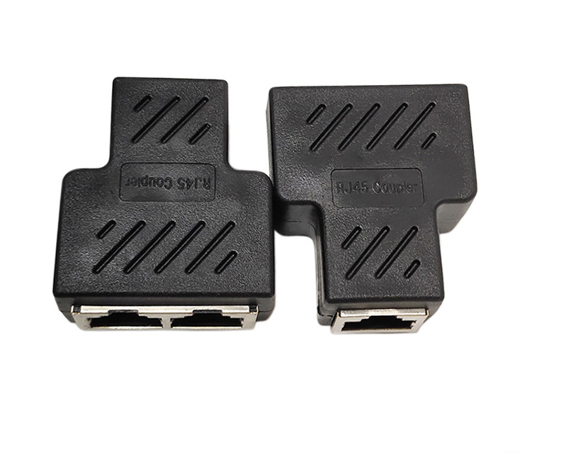

# OBD Power and Splitter Description

## Where to buy

Link to my Store: [https://shop.tlbb.ca/products/obd-and-splitter](https://shop.tlbb.ca/products/obd-and-splitter)

Link to my Etsy Store: [https://www.etsy.com/ca/listing/1018215440/obd-power-and-splitter-for-comma-pedal](https://www.etsy.com/ca/listing/1018215440/obd-power-and-splitter-for-comma-pedal)

***

## Product Description - OBD Power

OBD Power is the original Comma power.

It provides 12V power to your Comma device via the OBD port. \
12V from the OBD port usually stays alive after the car is off, which means your Comma device will stay on.\
It also connects 1 CAN bus from your comma device to the OBD port.

You will need an additional ethernet cable (again, please avoid flat noodle cables) to connect.

<figure><figcaption></figcaption></figure>

## Product Description - Splitter

RJ45 Splitter for comma pedal Tested working with comma pedal and comma power

A schematic of correct splitter wiring is provided. You can also find your own splitter if needed.

**Wrong splitter will short your car wire and cause burning**

**Pedals will not be refunded for the issue of using the wrong splitter.**

<figure><figcaption></figcaption></figure>

## **Installation**

**The optional OBD connects to your OBD-II port, please use a splitter to connect it to your pedal.**

<figure><figcaption></figcaption></figure>

***

## Splitter Schematic

<figure><figcaption></figcaption></figure> <figure><figcaption></figcaption></figure>

***
