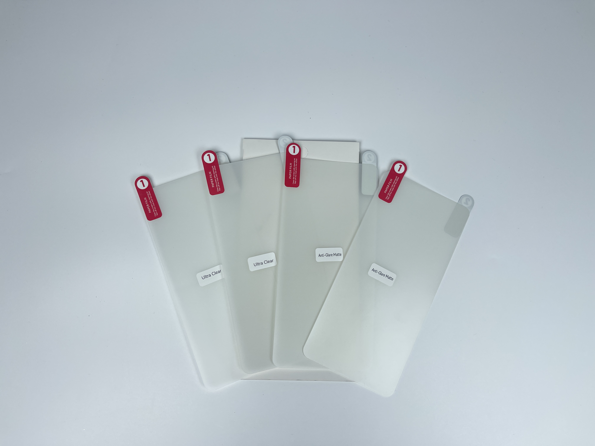
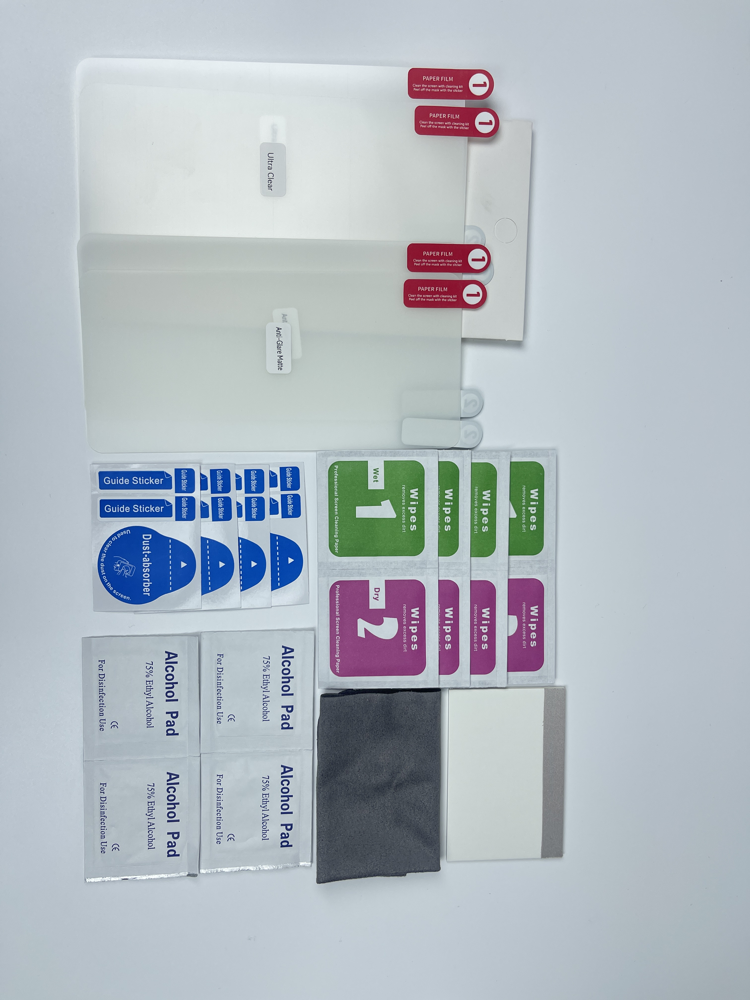
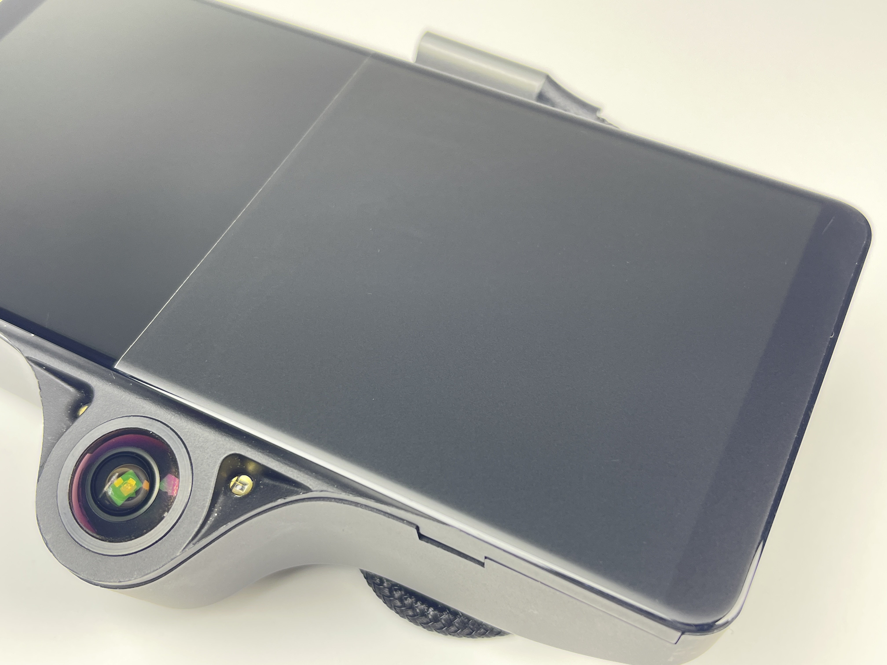
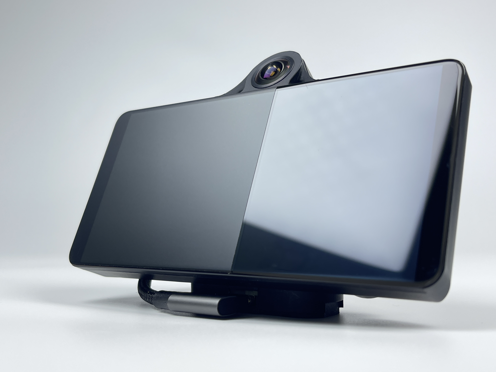
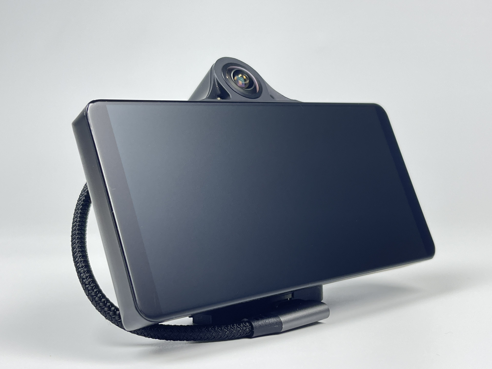
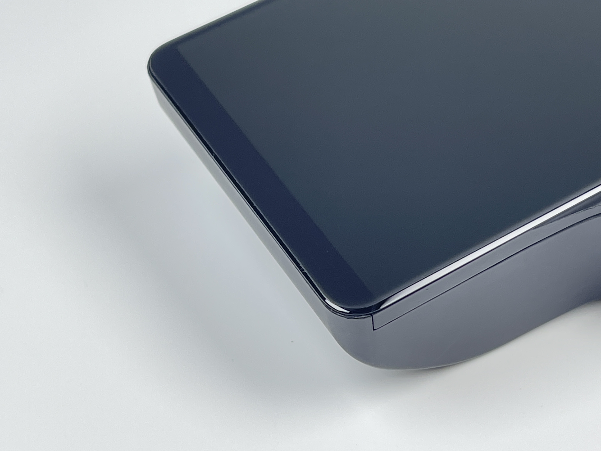
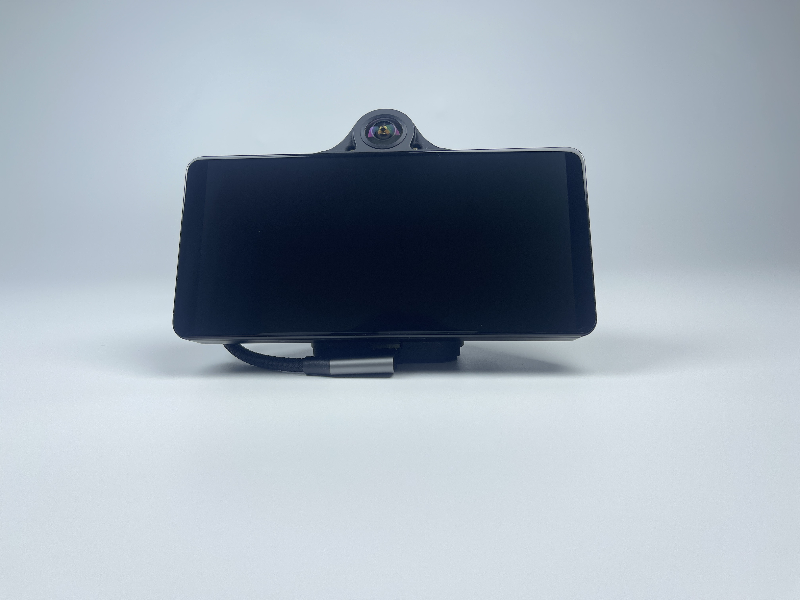
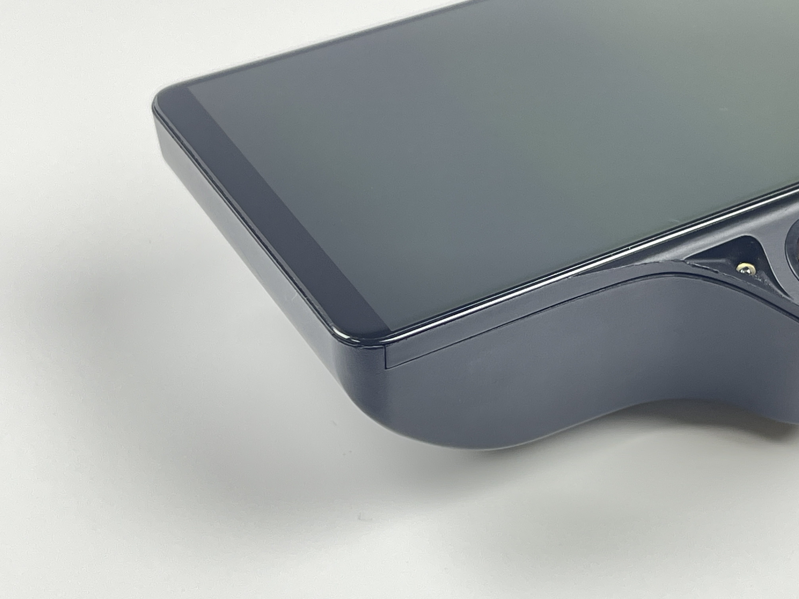
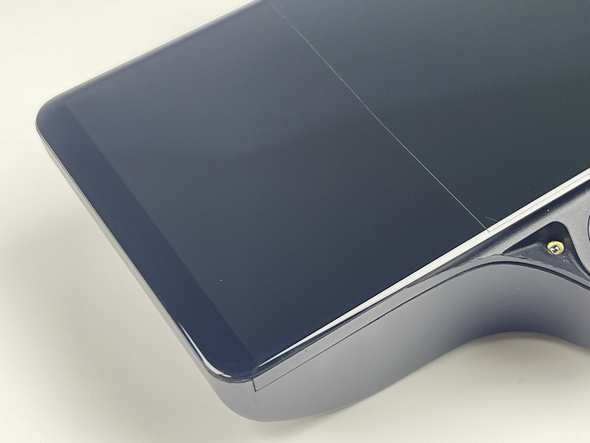
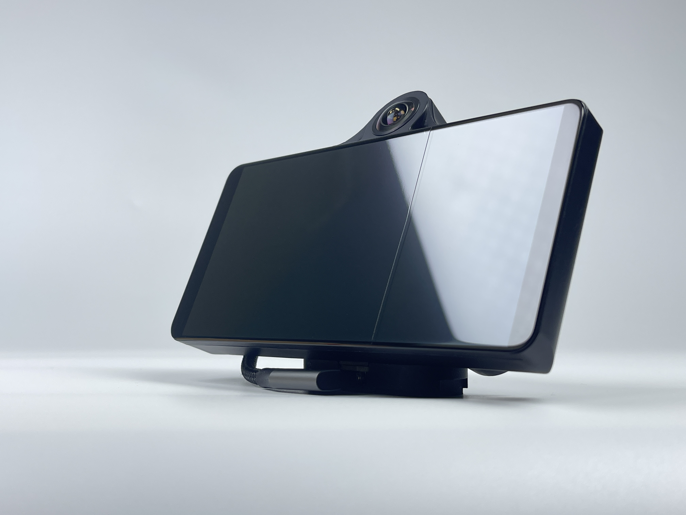

# OpenPilot Comma 3 & 3X Screen Protector Film

## Where to buy

Link to my Store:&#x20;

Screen Protector Film: [https://shop.tlbb.ca/products/c3-c3x-screen-protector](https://shop.tlbb.ca/products/c3-c3x-screen-protector)

Link to my Etsy Store:

Screen Protector Film: [https://www.etsy.com/ca/listing/1879407633/c3-c3x-screen-protector-2-matte-2-clear](https://www.etsy.com/ca/listing/1879407633/c3-c3x-screen-protector-2-matte-2-clear)

***

## Product Description

**OpenPilot Comma 3 & 3X Screen Protector Film (2 Clear + 2 Matte)**

<figure><figcaption></figcaption></figure> <figure><figcaption></figcaption></figure>

**Protect Your Comma Device with Our Premium Screen Protector Film**

While tempered glass screen protectors are commonly used for devices due to their strength and durability, we’ve found that they need to be cut smaller for the Comma 3 and 3X. This is because tempered glass is rigid and cannot bend around the corners perfectly. As a result, it leaves the fragile corners exposed, which is the most vulnerable place on screen and can reduce overall protection. We haven’t found a good solution for this limitation with tempered glass, which is why we’ve turned to **hydrogel film**.

Introducing our **Hydrogel Film** screen protectors, which **wrap perfectly around every corner of your screen**, providing full coverage and enhanced protection. The flexible nature of hydrogel film allows it to conform seamlessly to the edges of your device, ensuring complete protection against scratches, dust, and fingerprints.

**Anti-Glare Matte Film**

<figure><figcaption></figcaption></figure> <figure><figcaption></figcaption></figure> <figure><figcaption></figcaption></figure> <figure><figcaption></figcaption></figure>

**Ultra Clear Film**

<figure><figcaption></figcaption></figure> <figure><figcaption></figcaption></figure> <figure><figcaption></figcaption></figure> <figure><figcaption></figcaption></figure>

**Why Choose Our Screen Protector Film?**

* **Better Coverage**: **Hydrogel film** is flexible and conforms to every edge, providing complete protection. Unlike rigid glass, it ensures that every part of the screen, including the corners, is covered.
* **Reduced Reflection (anti-glare matte)**: Hydrogel film significantly reduces screen glare and reflection.
* **Highly transparent (ultra-clear)**: providing clearer visibility in different lighting conditions.
* **Durable & Scratch-Resistant**: Designed to withstand daily wear and tear, our hydrogel film protects your device from scratches and minor impacts.
* **Easy Application**: The film comes with a full application kit, including cleaning wipes, guide stickers, and an alcohol pad, making installation easy and hassle-free.

**What’s Included:**

* **2 Clear Screen Protectors**: Ideal for users who want to maintain the vibrant and sharp display of the original screen.
* **2 Matte Screen Protectors**: Perfect for reducing glare and providing a smooth, anti-fingerprint surface.
* **Full Application Kit**: Includes cleaning wipes, alcohol pads, dust absorbers, glass cleaning cloth, and guide stickers to ensure an easy and bubble-free application.

**Customer Feedback Wanted!**

This first batch includes both **clear** and **matte** options, and I’d love to hear your feedback on which one works best for you. While matte is often favored for reducing glare, your input will help us decide which version we should focus on for future batches.

Please join our discord to leave your feedback: [http://discord.innoisle.com/](http://discord.innoisle.com/)

***

