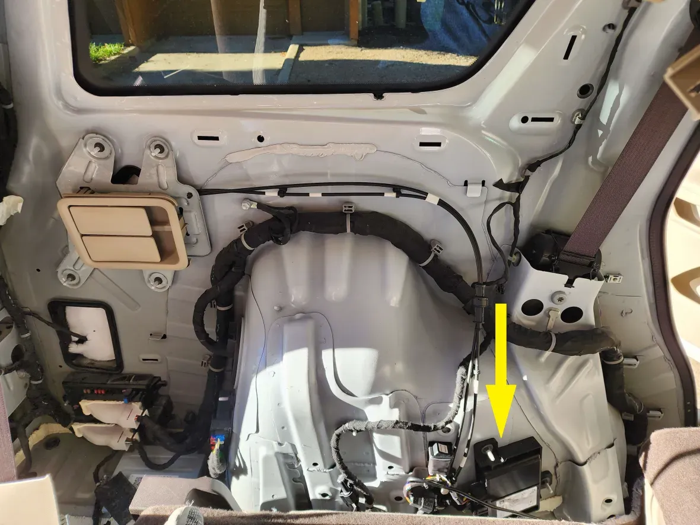
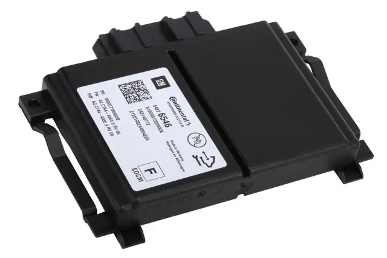

# SASCM

## Where to buy

Link to my Store:&#x20;

SASCM: [https://shop.tlbb.ca/products/sascm-for-gm-vehicles](https://shop.tlbb.ca/products/sascm-for-gm-vehicles)

Link to my Etsy Store:

SASCM Harness Set: [https://www.etsy.com/ca/listing/1840924033/sascm-for-gm-vehicles](https://www.etsy.com/ca/listing/1840924033/sascm-for-gm-vehicles)

***

## Product Description

**SASCM for GM**

It will intercept your ASCM module, allowing Openpilot to send a longitudinal control message to your vehicle while blocking the ASCM message.

**Supported vehicles:**

* Chevy Volt (2016-2018)  （with Adaptive Cruise Control）
* Chevy Volt (2019) - _pedal also needed_
* Acadia Denali （2018）
* Buick Enclave
* Cadillac XT4
* Chevy Traverse  (2022-2023)
* Buick Baby Enclave
* Cadillac XT5
* Cadillac XT6
* Chevy Malibu XL

**Where to find your SASCM connection point: It is the same connection port as ASCM.**

**If you already have ASCM installed, then you do have a SASCM connector available.**&#x20;

An ASCM is a module mounted in the left rear inner quarter and it would need to be bypassed.

<figure><figcaption></figcaption></figure>

A close-up picture:

<figure><figcaption></figcaption></figure>

What the module looks like:

<figure><figcaption></figcaption></figure>

Here is the example location for **Regal TourX**:

<figure><figcaption></figcaption></figure> <figure><figcaption></figcaption></figure>

## Installation Guide

The installation instruction for SASCM is basically the same as ASCM. While locating the ASCM, you will find the other port for SASCM.

Please refer to ASCM's installation instruction:

This is how you connect older style harness: https://docs.google.com/document/d/1bAoENo8edsbknXUx6bcx-L0-9dbgItJRCfd6DIyGDN0/edit?tab=t.0\
For the new ASCM harness, please locate the ASCM module and run the harness like a normal openpilot setup.
