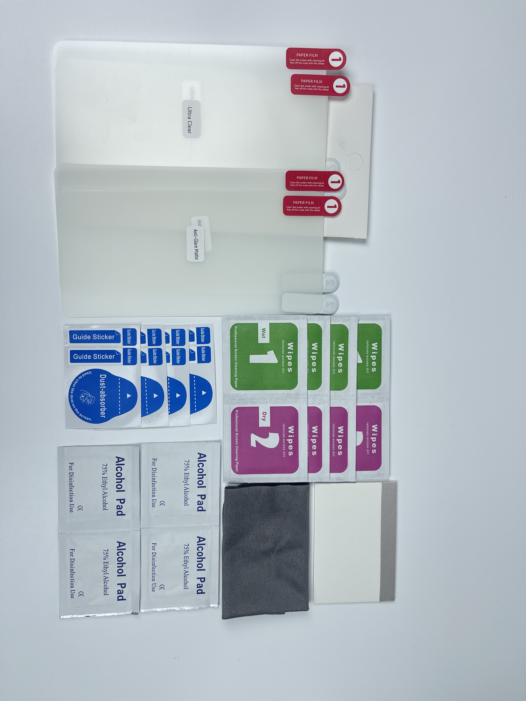
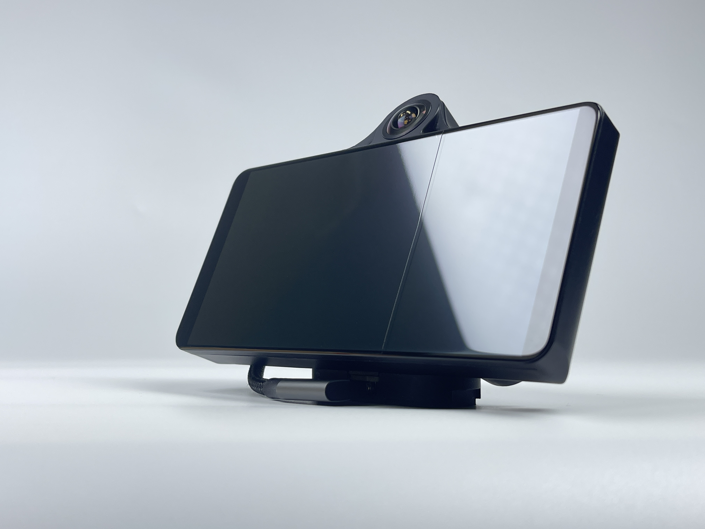

# Screen Protector

## Where to buy

Link to my Store:&#x20;

OP Device Stand: [https://www.etsy.com/ca/listing/1879407633/c3-c3x-screen-protector-2-matte-2-clear](https://www.etsy.com/ca/listing/1879407633/c3-c3x-screen-protector-2-matte-2-clear?)

Link to my Etsy Store:

OP Device Stand: [https://shop.tlbb.ca/products/c3-c3x-screen-protector](https://shop.tlbb.ca/products/c3-c3x-screen-protector)

***

## Product Description

Based on the feedback we have received, matte screen protectors are more popular. Therefore, we will change the screen protector pack to 4 matte.\
The clear screen protector will only be included in our carry case product.

#### Screen Protector (4 Matte)

**What you will receive:**

<figure><figcaption></figcaption></figure>

**What it looks like after installation**&#x20;

<figure><figcaption></figcaption></figure> <figure><figcaption></figcaption></figure>

<figure><figcaption></figcaption></figure> <figure><figcaption></figcaption></figure>

**Protect Your Comma Device with Our Premium Screen Protector Film**


While **tempered glass screen protectors** are commonly used for devices due to their strength and durability, we’ve found that they need to be cut smaller for the Comma 3 and 3X. This is because **tempered glass** is rigid and cannot bend around the corners perfectly. As a result, it leaves the fragile corners exposed, which is the most vulnerable place on screen and can reduce overall protection. We haven’t found a good solution for this limitation with tempered glass, which is why we’ve turned to **hydrogel film**.
\
Introducing our Hydrogel Film screen protectors, which **wrap perfectly around every corner of your screen**, providing full coverage and enhanced protection. The flexible nature of hydrogel film allows it to conform seamlessly to the edges of your device, ensuring complete protection against scratches, dust, and fingerprints.

**Why Choose Our Screen Protector Film?**

**Better Coverage**: Hydrogel film is flexible and conforms to every edge, providing complete protection. Unlike rigid glass, it ensures that every part of the screen, including the corners, is covered.

**Reduced Reflection** (anti-glare matte): Hydrogel film significantly reduces screen glare and reflection.

**Highly transparent** (ultra-clear): providing clearer visibility in different lighting conditions.

**Durable & Scratch-Resistant**: Designed to withstand daily wear and tear, our hydrogel film protects your device from scratches and minor impacts.

**Easy Application**: The film comes with a full application kit, including cleaning wipes, guide stickers, and an alcohol pad, making installation easy and hassle-free.
\
What’s Included:

**2 Clear Screen Protectors**: Ideal for users who want to maintain the vibrant and sharp display of the original screen.

**2 Matte Screen Protectors**: Perfect for reducing glare and providing a smooth, anti-fingerprint surface.

**Full Application Kit**: Includes cleaning wipes, alcohol pads, dust absorbers, glass cleaning cloth, and guide stickers to ensure an easy and bubble-free application.

**Using it with a Slidemount**

## Installation Guide



Please join our discord to leave your feedback: [http://discord.innoisle.com/](http://discord.innoisle.com/)

***

