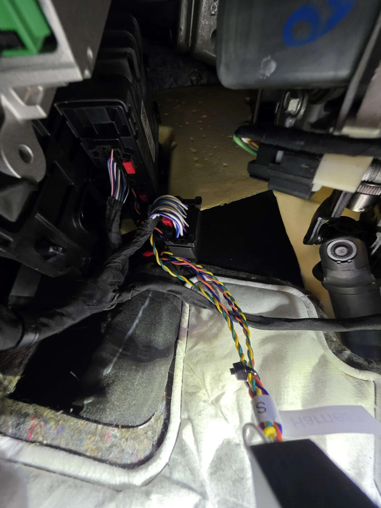

# SDGM Harness

## Where to buy

Link to my Store:&#x20;

SDGM Harness Set: [https://shop.tlbb.ca/products/sdgm-harness](https://shop.tlbb.ca/products/sdgm-harness)

Harness Box 2x9 pin & 2x 13 pin: [https://shop.tlbb.ca/products/openpilot-harness-box-v1-2x13-pin-and-v2-2x9-pin-with-rj-45-port](https://shop.tlbb.ca/products/openpilot-harness-box-v1-2x13-pin-and-v2-2x9-pin-with-rj-45-port)

Link to my Etsy Store:

SDGM Harness Set: [https://www.etsy.com/ca/listing/1840113327/sdgm-harness](https://www.etsy.com/ca/listing/1840113327/sdgm-harness)

Harness Box 2x9 pin & 2x 13 pin: [https://www.etsy.com/ca/listing/1800366135/openpilot-harness-box-v1-2x13-pin-and-v2](https://www.etsy.com/ca/listing/1800366135/openpilot-harness-box-v1-2x13-pin-and-v2)

Link to RetroPilot Store: [https://shop.retropilot.org/product/sdgm-harness-set/](https://shop.retropilot.org/product/sdgm-harness-set/)

***

## Product Description

This harness is 2x9 pin and works with 2x9 pin harness box

<figure><figcaption></figcaption></figure> <figure><figcaption></figcaption></figure>

There are **2 types of SDGM Harness**, SDGM A and SDGM B. Please make sure you choose the correct one for your vehicle.

**Supported vehicles:**

**(If your car make is listed, but the year is different. SDGM might work if you have LKAS.)**

**SDGM A:**

* Buick Enclave (2019)
* Buick Baby Enclave (CN)
* Chevy Volt (2019)
* Cadillac XT4 (2023)
* Chevy Traverse  (2022, 2023)
* Chevy Malibu XL 2019

**SDGM B:**

* Cadillac XT6
* Chevy Blazer 2022, 2024, 2025

**Please make sure your vehicle has a SDGM harness connection point to proceed**

If you are using SDGM & SASCM, please use Kaofui fork to enjoy the best compatibility:\
[https://smiskol.com/fork/firestar5683/Kaofui/Kaofui](https://smiskol.com/fork/firestar5683/Kaofui/Kaofui)

**Where to find your SDGM connection point:**

The SDGM is under the dash and it blocks the CAN bus data from the OBD-II port.

It should near the OBD port.

<figure><figcaption></figcaption></figure>

Shout out to Mochi, who helped with various GM vehicle harness developments.

Please refer to Mochi's instructions about SDGM:

[https://github.com/garrettpall/GMSDGMConnector/blob/main/2019\_volt/2019\_Volt\_Readme.md](https://github.com/garrettpall/GMSDGMConnector/blob/main/2019_volt/2019_Volt_Readme.md)
