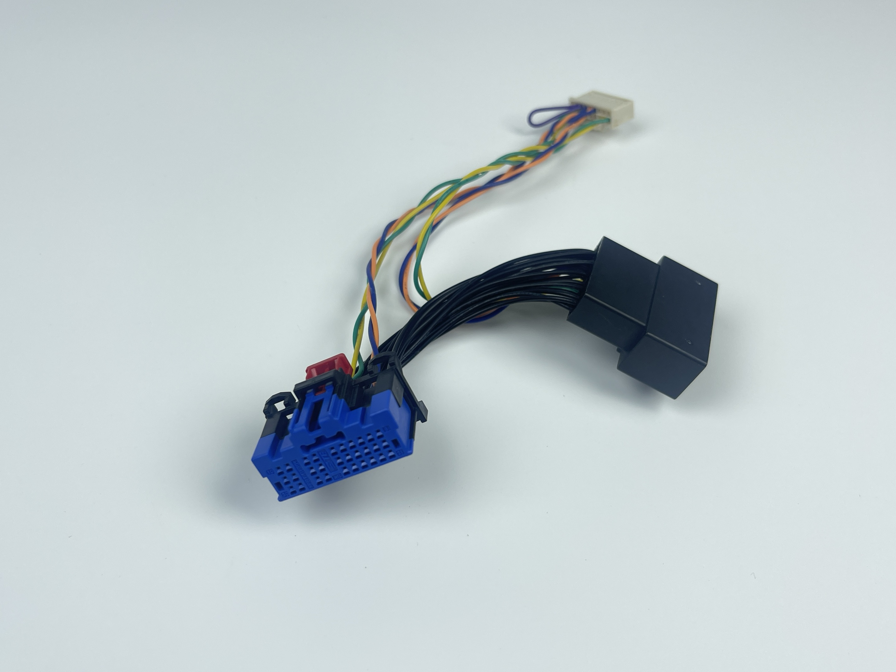
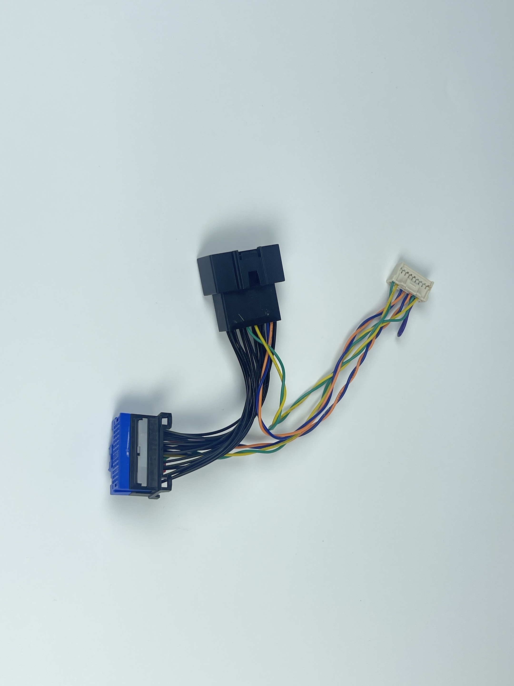
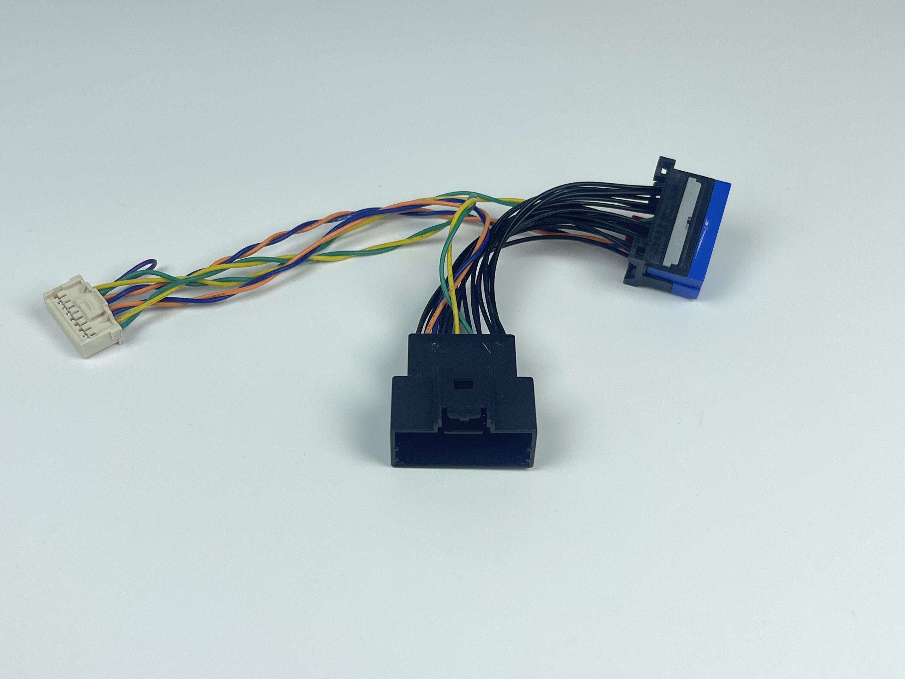

# SDGM Harness

## Where to buy

Link to my Store:&#x20;

SDGM Harness Set: [https://shop.tlbb.ca/products/sdgm-harness](https://shop.tlbb.ca/products/sdgm-harness)

Harness Box 2x9 pin & 2x 13 pin: [https://shop.tlbb.ca/products/openpilot-harness-box-v1-2x13-pin-and-v2-2x9-pin-with-rj-45-port](https://shop.tlbb.ca/products/openpilot-harness-box-v1-2x13-pin-and-v2-2x9-pin-with-rj-45-port)

Link to my Etsy Store:

SDGM Harness Set: [https://www.etsy.com/ca/listing/1840113327/sdgm-harness](https://www.etsy.com/ca/listing/1840113327/sdgm-harness)

Harness Box 2x9 pin & 2x 13 pin: [https://www.etsy.com/ca/listing/1800366135/openpilot-harness-box-v1-2x13-pin-and-v2](https://www.etsy.com/ca/listing/1800366135/openpilot-harness-box-v1-2x13-pin-and-v2)

***

## Product Description

This harness is 2x9 pin and works with 2x9 pin harness box

<figure><figcaption></figcaption></figure> <figure><figcaption></figcaption></figure> <figure><figcaption></figcaption></figure>

**Supported vehicles:**

* Buick Enclave
* Chevy Volt (2019)
* Cadillac XT4
* Chevy Traverse
* Buick Baby Enclave (CN)
* Cadillac XT5 (CN)
* Cadillac XT6 (CN)
* Chevy Malibu XL (CN)

\*(CN) means Chinese market vehicle. Usually, it is not ported to mainstream openpilot nor any fork that's found in the openpilot community. Your mileage may vary.&#x20;

Shout out to Mochi, who helped with various GM vehicle harness developments.

Please refer to Mochi's instructions about SDGM:

[https://github.com/garrettpall/GMSDGMConnector/blob/main/2019\_volt/2019\_Volt\_Readme.md](https://github.com/garrettpall/GMSDGMConnector/blob/main/2019_volt/2019_Volt_Readme.md)
