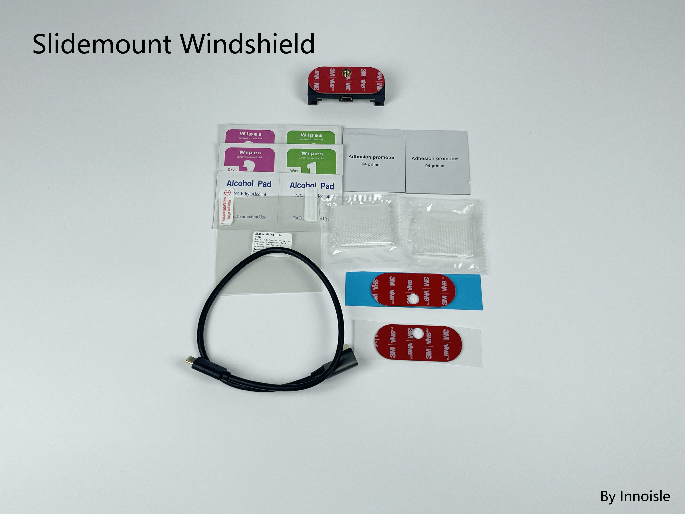

# Side Slidemount C4 Description

## Description:

An updated Side Slidemount for the newly released C4!

<figure><figcaption></figcaption></figure> <figure><figcaption></figcaption></figure>

## _**Notice**_

**The new slidemount will slide sideways, with CNC aluminum brackets.**\
**Please sign up for notification!** \
[https://shop.beartech.ca/products/beartech-side-slidemount-c4](https://shop.beartech.ca/products/beartech-side-slidemount-c4?variant=52038271303861)

## **Product Highlights**

1. CNC aluminum C4 holding bracket (at the center)
2. All screwed-in design with no epoxy or any adhesive on the structural parts.
3. 2X the VHB tape area, pair with reduced-weight C4, means not waiting for VHB to cure.
4. Curved mounting surface on the windshield side to better fit any windshield.
5. Right-angle USB-C cable.
6. Together with the Side Slide mechanism for maximum top space saving.&#x20;

**And features that users liked from the last Slidemount for C3X:**

1. 2 Tier sliding for short movement.
2. Magnet guiding and holding for easy one-hand operation.
3. Blade-style pin for robust connection.

<figure><figcaption></figcaption></figure> <figure><figcaption></figcaption></figure>

<figure><figcaption></figcaption></figure> <figure><figcaption></figcaption></figure>

## Where to buy:

Link to my Store:

Side Slidemount Set: [https://shop.beartech.ca/products/beartech-side-slidemount-c4](https://shop.beartech.ca/products/beartech-side-slidemount-c4?variant=52038271303861)

Link to my Etsy Store:

Side Slidemount set:&#x20;

Link to RetroPilot Store:

Side Slidemount Set:

## Installation Guide:

**Installation guide**


[slidemount-installation.md](slidemount-installation.md)


**Quick description and installation video**

***

## **What is included:**

**What is included in the Side Slidemount Set:**

<figure><figcaption></figcaption></figure> <figure><figcaption></figcaption></figure>

**Slidemount Set:**\
1\. Slidemount Set Pack:\
\- Device Side Mount x1\
\- Windshield Side Mount x1\
2\. Type C pack\
\- 13cm Right Angle Head Type-C to Right Angle Head Type-C Cable\
(Connect the comma device and the Device Side Mount)\
\- 45cm Right Angle Head Type-C to Stright Type-C Cable\
(Connect harness box and the Windshield Side Mount)\
3\. VHB Tape pack\
\- Cut to size 3M VHB Tape x2\
(Stick the Windshield Side Mount to Car Windshield)\
\- Wet & Dry wipes x2\
(Clean the windshield before apply)\
\- IPA wipe x2\
(Clean the windshield before apply)\
\- Static film x2\
(Stick to the windshield before sticking the VHB tape for easy removal in the future\
ONLY stick to glass (no tint on the windshield)\
If your local weather exceeds 40C (or 104F), static film is not recommended.\
4\. Adhesion Promoter pack\
\- Adhesion Promoter Wipe x2\
(Enhance adhesion for non-glass surfaces, adhesion for dummy mount)\
\- PE gloves x2\
4\. Tightening Kit x1\
(Adjust set screw)\
Allen Key x1\
Set Scre x2

**What is included in Windshield Slidemount:**

<figure><figcaption></figcaption></figure> <figure><figcaption></figcaption></figure>

1\. Windshield Slidemount Pack:\
\- Windshield Side Mount x1\
2\. Type C pack\
\- 45cm Right Angle Head Type-C to Stright Type-C Cable\
(Connect harness box and the Windshield Side Mount)\
3\. VHB Tape pack\
\- Cut to size 3M VHB Tape x2\
(Stick the Windshield Side Mount to Car Windshield)\
\- Wet & Dry wipes x2\
(Clean the windshield before apply)\
\- IPA wipe x2\
(Clean the windshield before apply)\
\- Static film x2\
(Stick to the windshield before sticking the VHB tape for easy removal in the future\
ONLY stick to glass (no tint on the windshield)\
If your local weather exceeds 40C (or 104F), static film is not recommended.\
4\. Adhesion Promoter pack\
\- Adhesion Promoter Wipe x2\
(Enhance adhesion for non-glass surfaces, adhesion for dummy mount)\
\- PE gloves x2

## Add-ons

We are still working on the add-ons for C4, including but not limited to Suction rack, OP device stand, carry case, and CPL filter, etc

***

## Warnings and Cautions

1. Magnets:
   1. Warning: The strong magnets in this product can cause severe pinching injuries. Always handle with care and avoid placing fingers near the magnetic connection points. Do not play with the magnets, as they can attract unexpectedly and lead to injury.
   2. Caution: Keep all magnetic components away from electronic devices, credit cards, and other magnetic-sensitive materials. Failure to do so may result in damage to these items.
   3. Caution: Store the device away from children and pets to prevent accidental injury or ingestion.
2. Adhesion Promoter:
   1. Warning: Keep out of reach of children. Always use provided gloves during application. This product is highly flammable; keep away from heat sources and open flames. Causes serious eye irritation and may result in an allergic skin reaction. It may be fatal if swallowed and enters airways. May cause drowsiness or dizziness, and has potential reproductive effects. Long-term exposure may damage sensory organs and the nervous system.
3. Type-C Cables:
   1. Warning: Keep out of reach of children. Do not pull the cable with excessive force, and ensure the cable is firmly attached to prevent damage.
4. VHB Tape:
   1. Warning: Keep out of reach of children.
   2. Caution: Ensure the bonding surface is clean and dry before applying the VHB tape for optimal adhesion.
5. Thread Locker:
   1. Warning: Keep out of reach of children.
   2. Hazard Statements: Causes serious eye irritation and may cause an allergic skin reaction.
6. Static Cling Film:
   1. Warning: Keep out of reach of children.

#### General Safety

* Caution: Always follow the installation instructions carefully. Improper installation may lead to device malfunction, damage to your vehicle, or personal injury.
* Caution: Ensure that the mount is securely attached before driving. Regularly check for any signs of wear or loosening.
* Warning: Do not overload the mount or exceed the weight limit of the device. This could cause the mount to detach unexpectedly while in use.
* Caution: Avoid using the device in extreme weather conditions (e.g., excessive heat or cold) that may affect its performance and adhesion.
* Caution: Be aware of your surroundings when installing or removing the mount to prevent accidents or injuries.

#### Liability Disclaimer

Warning: The manufacturer is not responsible for any injuries, damages, or malfunctions resulting from improper installation, use, or handling of this product. Use at your own risk.
