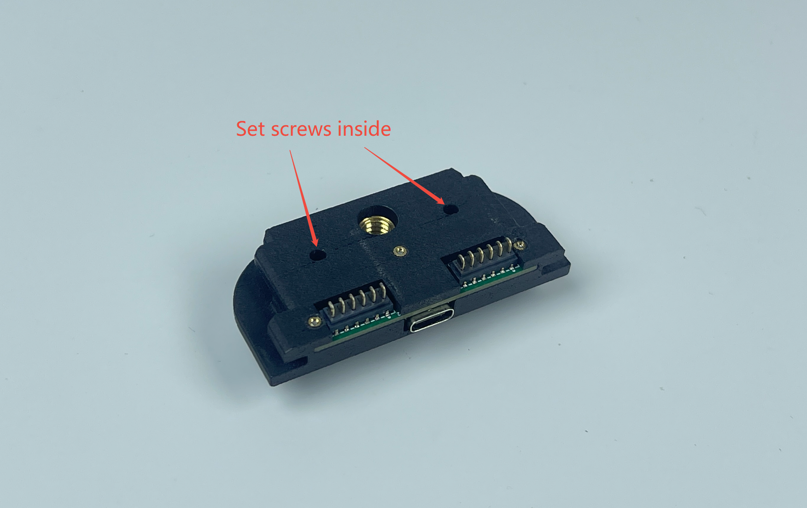
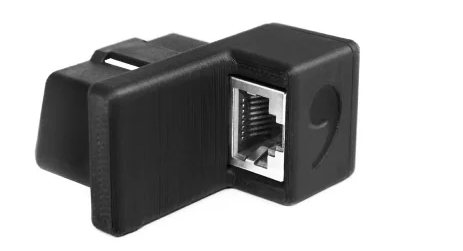

# Slidemount Installation Guide - After 2025Aug1st

\*Disclaimer: This is a guide only.

**This installation guide applies to the magmount purchased after July 2025.**\

## **Set Screw Warning:**

**\*Over-tightening the set screw could break your slidemount**

**Set screw is required for Slidemount**: \
\- **Lose the protruded set screw** **before installation** so it won't block you from installing the slidemount\
\- After attaching the mount to device, tighten the pre-install set screws at the left and right side of the Slidemount.\
\- Tighten it **just enough** that you can't move the Slidemount. \
\- **Do not over-tighten it**, as the screw is small and is only intended to prevent movement. \
\- Over-tightening it will cause the **breakage of the mounting bracket**.&#x20;

<figure><figcaption></figcaption></figure>

If the small set screw is not enough (especially if you are using a clone device), please add the larger set screw included (¼ screw). (Please also tighten it **just enough**.)

**\*\*Example of an over-tightened set screw:**\
The set screw in the pictures below are over-tightened way too much. \
Otherwise, the mounting bracket could break (as shown in the picture)

<figure><figcaption></figcaption></figure>

<figure><figcaption></figcaption></figure>

### **Compatibility Warning:**&#x20;

**Slidemount may not support 3rd party comma devices.**\
**We don't guarantee compatibility of Slidemount on any device other than the comma C3X, C3 and C2. Thank you for understanding.**

***

## Installation Steps

### Before installing the slidemount, please find the description for each component in your package here:


[slidemount.md](slidemount.md)


### Short video with a brief installation guide



### (Optional) Prepare your magmount: (ONLY if you redo the VHB)

1. All slidemount and angle wedge already come with **pre-applied VHB**. \
   If you would like to **redo the VHB**, then please follow the steps to prep it.\
   Please make sure you **apply the adhesion promoter** before applying the VHB.&#x20;
2. Warning: Apply the VHB tape to the slidemount, angle wedges or comma mount adapter first before you stick it on the windshield. And apply the VHB in warm temp.\
   If you are reapplying the VHB tape, Clean the surface with isopropyl alcohol and ensure that no residue remains.
3. **(Important)** The ideal application temperature for VHB is above 70°F or 21°C. The minimum application temperature is 50°F and 10°C. If the temperature is lower than the minimum required, you can try to heat up the application area before and after attaching the magmount. Use common sense when heating the application area and avoid overheating or leaving it unattended. The VHB also need the above minimum required temperature for curing. Please leave it at least 24 hours or 1.5x the curing time recommended by 3M. Below is a snippet of recommended bond time from the 3M datasheet.
4. 
5. Take the Windshield Side Mount.
6. Wipe the back of the Windshield Side Mount with the IPA wipe.
7. Apply **adhesion promoter to every surface (except on glass)**  that the VHB is going to stick to and let it dry. (If you have windshield tint, please try it on a small area first, some tint does not do well with the adhesion promoter)
8. Apply VHB tape to the Windshield Side Mount.
9. **Clamp or use weight** on the complete slidemount for **at least 5 hours** so VHB makes perfect contact to the surface. **Every VHB-connected surface** needs to be clamped. (The complete slidemount here means slidemount with angle wedges and VHB or slidemount with mount adapter sticked together. )

### Slidemount Windshield and Device Side Installation Guide

1. Mark the **center position** where the Slidemount will be installed

<figure><figcaption></figcaption></figure>

2. Use the Wet wipes **(VHB Tape pack)** to clean the marked area on the windshield inside the vehicle
3. Use the Dry wipes **(VHB Tape pack)** to further clean the same area on the windshield
4. Use the IPA wipes **(VHB Tape pack)** to thoroughly clean the marked area on the windshield
5. Apply the Static film **(VHB Tape pack)** to the windshield. **Note**: If your local weather exceed 40°C (104°F), avoid using the static film.
6. Take the Windshield Side Mount.
7. See [#optional-prepare-your-magmount-only-if-you-redo-the-vhb](slidemount-installation.md#optional-prepare-your-magmount-only-if-you-redo-the-vhb "mention")  applying VHB on slidemount. Remember to **clamp your mount** **and VHB** after you apply the VHB on the Slidemount.
8. **(Important)** The ideal application temperature for VHB is above 70°F or 21°C. The minimum application temperature is 50°F and 10°C. If the temperature is lower than the minimum required, you can try to heat up the application area before and after attaching the magmount. Use common sense when heating the application area and avoid overheating or leaving it unattended. The VHB also need the above minimum required temperature for curing. Please leave it at least 24 hours or 1.5x the curing time recommended by 3M. Below is a snippet of recommended bond time from the 3M datasheet.\
   
9. **(Important)** Please **leave enough room to slide the mount in and out**. Please **leave minimum 3.5cm (1.4 inch)**&#x20;
10. If you are using an angle wedge, please **DO NOT DOUBLE LAYER the VHB** between the angle wedge and windshield mount. Double-layering might cause the mount to be unstable.\
    If there is VHB on both side of the angle wedge, peel one side off. And use adhesion promoter when attaching the windshield mount to the angle wedge.\
    So the setup should be: **VHB - Angle Wedge - VHB (Only one layer of VHB) - Windshield Mount**
11. If you decide to use the Comma Mount adapter, instead of redoing the VHB for winshield mount, please **DO NOT DOUBLE LAYER the VHB** between the comma mount adapter and windshield mount\
    If there is VHB on the Comma Mount Adapter, peel it off. And use adhesion promoter when attaching the windshield mount to the comma mount adapter.\
    The setup should be: **Comma Mount Adapter - VHB (Only one layer of VHB)- Windshield Mount**
12. Attach the Windshield Side Mount to the Static film if you applied it in step 5, or attach it to the windshield if the static film isn't applied. Try not to leave bubbles in VHB. Install it at a warm temperature and push firmly for optimal contact. During the time when VHB is curing, push firmly every hour to achieve optimal adhesion.&#x20;

<figure><figcaption></figcaption></figure>

11. Connect the 45cm Type-C cable to the Windshield Side Mount
12. Connect the other side of the Type C cable to the harness box. Use the cable organizers **(Optional)** to tidy up the cable if needed.

<figure><figcaption></figcaption></figure>

13. Take the Device Side Mount and slide it onto the Comma Device\
    \*\*Depending on the version you received, there might be a galvanized steel plate added to reduce the magnetic field. It might cause scratches on your Comma device. \
    If you **do not encounter a "Fan malfunction" issue** while using the slidemount, the galvanized steel plate is **not a mandatory part**; you can remove the galvanized steel plate before installing the Device Side Mount (warning: the plate could be very sharp on the edges)\
    The steel plate on the device mount is the galvanized steel plate. It is stuck on the slidemount by magnets and can be removed easily.

14. Use the 13cm Type C cable to connect the Device Side Mount to the Comma Device

<figure><figcaption></figcaption></figure> <figure><figcaption></figcaption></figure>

15. Set screw instruction (**Set screw is required for Slidemount**): \
    \- Lose the pre-installed set screws (they are screwed in wiht random depth)\
    \- Tighten the pre-install set screws at the left and right side of the Slidemount.\
    \- Tighten it **just enough** that you can't move the Slidemount.\
    \- **Do not over-tighten it**, as the screw is small and is only intended to prevent movement.

<figure><figcaption></figcaption></figure>

**\*\*Example of an over-tightened set screw:**\
The set screw in the picture below is over-tightened way too much. \
The mounting bracket could break (as shown in the picture)

<figure><figcaption></figcaption></figure> <figure><figcaption></figcaption></figure>

If you find the device mount **still sliding off your device**, then you can add the ¼ set screw (the larger set screw in the package)\
The installation process is the same as the magmount: (picture shows how to install it on a magmount)

<figure><figcaption></figcaption></figure>

Please tighten it **just enough** that there is a gap between the mount and the device. Make sure this line is **straight, not curved** when you tighten the set screw.

<figure><figcaption></figcaption></figure>

16. Carefully attach the Device Side Mount to the Windshield Side Mount. **Be cautious,** as the magnet is very strong and can pinch your fingers.
17. &#x20;Use the bubble level **(Optional)** to ensure the Comma Device is level

<figure><figcaption></figcaption></figure>

22. Use the Tilt Level meter (**Optional**) to confirm proper installation.\
    If it is not level, then an angle wedge might be needed.&#x20;

<figure><figcaption></figcaption></figure>

23. The installation process is complete. Please wait for VHB to cure, and you are all set.

<figure><figcaption></figcaption></figure>

24. Please keep the Windshield Side Mount Cover for future use. Reattach it after removing the Comma Device to prevent short-circuiting the mount.

***

## Replacement part installation guide

If you have a broken bracket on the devive mount, please follow this guide to install the replacement bracket.



## Warnings and Cautions

1. Magnets:
   1. Warning: The strong magnets in this product can cause severe pinching injuries. Always handle with care and avoid placing fingers near the magnetic connection points. Do not play with the magnets, as they can attract unexpectedly and lead to injury.
   2. Caution: Keep all magnetic components away from electronic devices, credit cards, and other magnetic-sensitive materials. Failure to do so may result in damage to these items.
   3. Caution: Store the device away from children and pets to prevent accidental injury or ingestion.
2. Adhesion Promoter:
   1. Warning: Keep out of reach of children. Always use provided gloves during application. This product is highly flammable; keep away from heat sources and open flames. Causes serious eye irritation and may result in an allergic skin reaction. It may be fatal if swallowed and enters airways. May cause drowsiness or dizziness, and has potential reproductive effects. Long-term exposure may damage sensory organs and the nervous system.
3. Type-C Cables:
   1. Warning: Keep out of reach of children. Do not pull the cable with excessive force, and ensure the cable is firmly attached to prevent damage.
4. VHB Tape:
   1. Warning: Keep out of reach of children.
   2. Caution: Ensure the bonding surface is clean and dry before applying the VHB tape for optimal adhesion.
5. Thread Locker:
   1. Warning: Keep out of reach of children.
   2. Hazard Statements: Causes serious eye irritation and may cause an allergic skin reaction.
6. Static Cling Film:
   1. Warning: Keep out of reach of children.

#### General Safety

* Caution: Always follow the installation instructions carefully. Improper installation may lead to device malfunction, damage to your vehicle, or personal injury.
* Caution: Ensure that the mount is securely attached before driving. Regularly check for any signs of wear or loosening.
* Warning: Do not overload the mount or exceed the weight limit of the device. This could cause the mount to detach unexpectedly while in use.
* Caution: Avoid using the device in extreme weather conditions (e.g., excessive heat or cold) that may affect its performance and adhesion.
* Caution: Be aware of your surroundings when installing or removing the mount to prevent accidents or injuries.

#### Liability Disclaimer

Warning: The manufacturer is not responsible for any injuries, damages, or malfunctions resulting from improper installation, use, or handling of this product. Use at your own risk.
