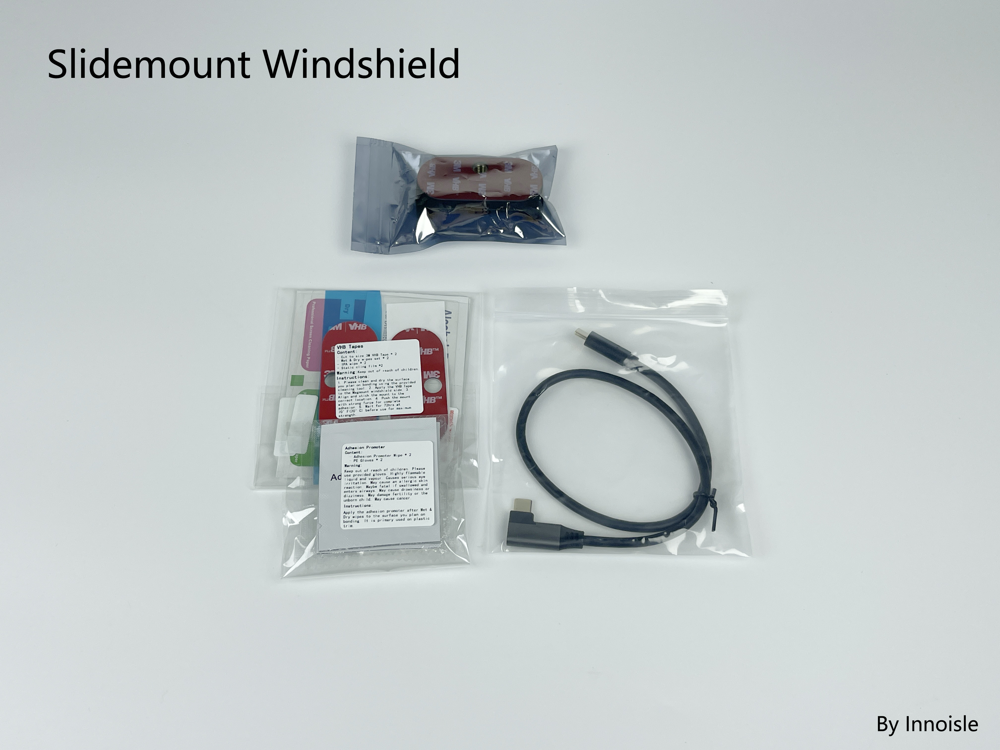
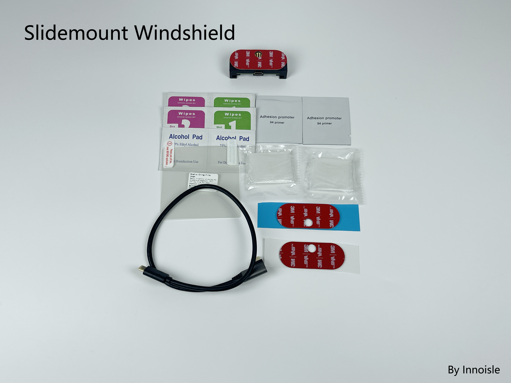

# Slidemount Description

## Description:

We’ve heard your requests, and we're excited to introduce the **Beartech Slidemount**!&#x20;

**Why Did We Create the Slidemount?**

The **Beartech Slidemount** was designed in response to community feedback:

1. Users wanted a **quick-mount solution** that offers physical contact, as some felt uncomfortable using the **Magmount**.
2. **Current Slidemount solutions** require a lot of space to install and remove, so we designed ours to require only **half the space** for a more compact and efficient experience.

## Where to buy:

Slidemount set and single windshield mount: [https://shop.tlbb.ca/products/beartech-slidemount](https://shop.tlbb.ca/products/beartech-slidemount)

Add-on Mounts for Magmount/ Slidemount: [https://shop.tlbb.ca/products/magmount-addon](https://shop.tlbb.ca/products/magmount-addon)

#### Vehicles that require Angle Wedge:

* Toyota Highlander (8 degree)
* Honda Pilot (8 degree)
* Ford F150 (8 degree)
* Ford Maverick (8 degree)
* Rivian Truck & SUV  (8 degree)
* And any windshield that makes your comma device tilt more than 5 degree

<figure><figcaption></figcaption></figure>

## Installation Guide:


[magmount-installation.md](magmount-installation.md)


## Videos:





***

## **What is included:**

**What is included in the Slidemount Set:**

<figure><figcaption></figcaption></figure> <figure><figcaption></figcaption></figure>

**Slidemount Set:**\
1\. Slidemount Set Pack:\
\- Device Side Mount x1\
\- Windshield Side Mount x1\
\- Windshield Mount Cover x1\
(Prevent short-circuiting after the device is pulled off)\
2\. Type C pack\
\- 13cm Right Angle Head Type-C to Right Angle Head Type-C Cable\
(Connect the comma device and the Device Side Mount)\
\- 45cm Right Angle Head Type-C to Stright Type-C Cable\
(Connect harness box and the Windshield Side Mount)\
3\. VHB Tape pack\
\- Cut to size 3M VHB Tape x2\
(Stick the Windshield Side Mount to Car Windshield)\
\- Wet & Dry wipes x2\
(Clean the windshield before apply)\
\- IPA wipe x2\
(Clean the windshield before apply)\
\- Static film x2\
(Stick to the windshield before sticking the VHB tape for easy removal in the future\
ONLY stick to glass (no tint on the windshield)\
If the temperature in your area is above 40C (or 104F), static film is not recommended)\
4\. Adhesion Promoter pack\
\- Adhesion Promoter Wipe x2\
(Enhance adhesion for non-glass surfaces, adhesion for dummy mount)\
\- PE gloves x2\
4\. Tightening Kit x1\
(Adjust set screw)\
Allen Key x1\
Set Scre x2

**What is included in Windshield Slidemount:**

<figure><figcaption></figcaption></figure> <figure><figcaption></figcaption></figure>

1\. Windshield Slidemount Pack:\
\- Windshield Side Mount x1\
\- Windshield Mount Cover x1\
(Prevent short-circuiting after the device is pulled off)\
2\. Type C pack\
\- 45cm Right Angle Head Type-C to Stright Type-C Cable\
(Connect harness box and the Windshield Side Mount)\
3\. VHB Tape pack\
\- Cut to size 3M VHB Tape x2\
(Stick the Windshield Side Mount to Car Windshield)\
\- Wet & Dry wipes x2\
(Clean the windshield before apply)\
\- IPA wipe x2\
(Clean the windshield before apply)\
\- Static film x2\
(Stick to the windshield before sticking the VHB tape for easy removal in the future\
ONLY stick to glass (no tint on the windshield)\
If the temperature in your area is above 40C (or 104F), static film is not recommended)\
4\. Adhesion Promoter pack\
\- Adhesion Promoter Wipe x2\
(Enhance adhesion for non-glass surfaces, adhesion for dummy mount)\
\- PE gloves x2

## Add-ons

The **Slidemount** will not include a dummy mount like the **Magmount** to keep the product clean and concise, as many users didn’t understand its purpose.&#x20;

If you still wish to protect your Comma device, we have our **storage case**.&#x20;


[carry-case-for-c3-c3x.md](carry-case-for-c3-c3x.md)


Additionally, accessories and add-ons such as the **Angle Wedge**, **Comma Mount Adapter**, and **OP Device Stand** are shared between the **Magmount** and **Slidemount**.

You can find them at:

Magmount Add-on Mounts: [https://shop.tlbb.ca/products/openpilot-magmount-magnetic-mount-add-on-for-comma-device](https://shop.tlbb.ca/products/openpilot-magmount-magnetic-mount-add-on-for-comma-device)

OP Device Stand: [https://shop.tlbb.ca/products/op-device-stand](https://shop.tlbb.ca/products/op-device-stand)

## Warnings and Cautions

1. Magnets:
   1. Warning: The strong magnets in this product can cause severe pinching injuries. Always handle with care and avoid placing fingers near the magnetic connection points. Do not play with the magnets, as they can attract unexpectedly and lead to injury.
   2. Caution: Keep all magnetic components away from electronic devices, credit cards, and other magnetic-sensitive materials. Failure to do so may result in damage to these items.
   3. Caution: Store the device away from children and pets to prevent accidental injury or ingestion.
2. Adhesion Promoter:
   1. Warning: Keep out of reach of children. Always use provided gloves during application. This product is highly flammable; keep away from heat sources and open flames. Causes serious eye irritation and may result in an allergic skin reaction. It may be fatal if swallowed and enters airways. May cause drowsiness or dizziness, and has potential reproductive effects. Long-term exposure may damage sensory organs and the nervous system.
3. Type-C Cables:
   1. Warning: Keep out of reach of children. Do not pull the cable with excessive force, and ensure the cable is firmly attached to prevent damage.
4. VHB Tape:
   1. Warning: Keep out of reach of children.
   2. Caution: Ensure the bonding surface is clean and dry before applying the VHB tape for optimal adhesion.
5. Thread Locker:
   1. Warning: Keep out of reach of children.
   2. Hazard Statements: Causes serious eye irritation and may cause an allergic skin reaction.
6. Static Cling Film:
   1. Warning: Keep out of reach of children.

#### General Safety

* Caution: Always follow the installation instructions carefully. Improper installation may lead to device malfunction, damage to your vehicle, or personal injury.
* Caution: Ensure that the mount is securely attached before driving. Regularly check for any signs of wear or loosening.
* Warning: Do not overload the mount or exceed the weight limit of the device. This could cause the mount to detach unexpectedly while in use.
* Caution: Avoid using the device in extreme weather conditions (e.g., excessive heat or cold) that may affect its performance and adhesion.
* Caution: Be aware of your surroundings when installing or removing the mount to prevent accidents or injuries.

#### Liability Disclaimer

Warning: The manufacturer is not responsible for any injuries, damages, or malfunctions resulting from improper installation, use, or handling of this product. Use at your own risk.
