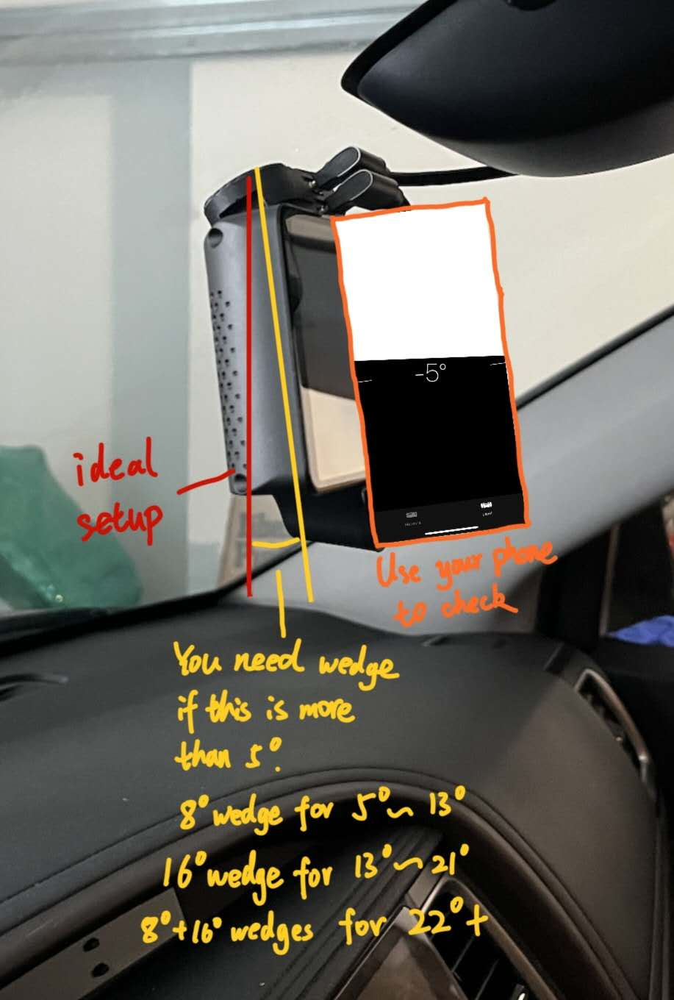

# Slidemount Description

## Slidemount Pre-Order available now!

We’ve heard your requests, and we're excited to introduce the **Beartech Slidemount**! After the success of the Magmount, we’re offering a **pre-order** for the Slidemount, available in **Essential** and **Pioneer** bundles.

**Why Did We Create the Slidemount?**

The **Beartech Slidemount** was designed in response to community feedback:

1. Users wanted a **quick-mount solution** that offers physical contact, as some felt uncomfortable using the **Magmount**.
2. **Current Slidemount solutions** require a lot of space to install and remove, so we designed ours to require only **half the space** for a more compact and efficient experience.

## Where to pre-order:

Slidemount Pre-order: [https://shop.tlbb.ca/products/beartech-slidemount-pre-order](https://shop.tlbb.ca/products/beartech-slidemount-pre-order)

***

<figure><figcaption></figcaption></figure>

## Essential Kit VS Premium Kit

What is included in Essential Kit:

* 1 x **Windshield Slidemount** (with VHB tape pre-applied)
* 1 x **Device Slidemount**
* 1 x **15cm (6-inch) Type-C Cable**
* 1 x **45cm (\~18-inch) Type-C Cable**
* 1 x **Tightening Kit**
* 2 x **VHB Tapes and Clean Kits**
* 2 x **Adhesion Promoters**

The **Essential Bundle** includes the core components for mounting, while the **Premium Bundle** offers the same components plus a **free upgrade** to the latest version of the Slidemount, redeemable a year later.

## Add-ons

The **Slidemount** will not include a dummy mount like the **Magmount** to keep the product clean and concise, as many users didn’t understand its purpose.&#x20;

If you still wish to protect your Comma device, we will have our **storage case** available soon.&#x20;

Additionally, accessories and add-ons such as the **Angle Wedge**, **Comma Mount Adapter**, and **OP Device Stand** are shared between the **Magmount** and **Slidemount**.

You can find them at:

Magmount Add-on Mounts: [https://shop.tlbb.ca/products/openpilot-magmount-magnetic-mount-add-on-for-comma-device](https://shop.tlbb.ca/products/openpilot-magmount-magnetic-mount-add-on-for-comma-device)

OP Device Stand: [https://shop.tlbb.ca/products/op-device-stand](https://shop.tlbb.ca/products/op-device-stand)

#### Vehicles that require Angle Wedge:

* Toyota Highlander (8 degree)
* Honda Pilot (8 degree)
* Ford F150 (8 degree)
* Ford Maverick (8 degree)
* Rivian Truck & SUV  (8 degree)
* And any windshield that makes your comma device tilt more than 5 degree

<figure><figcaption></figcaption></figure>

## Warnings and Cautions

1. Magnets:
   1. Warning: The strong magnets in this product can cause severe pinching injuries. Always handle with care and avoid placing fingers near the magnetic connection points. Do not play with the magnets, as they can attract unexpectedly and lead to injury.
   2. Caution: Keep all magnetic components away from electronic devices, credit cards, and other magnetic-sensitive materials. Failure to do so may result in damage to these items.
   3. Caution: Store the device away from children and pets to prevent accidental injury or ingestion.
2. Adhesion Promoter:
   1. Warning: Keep out of reach of children. Always use provided gloves during application. This product is highly flammable; keep away from heat sources and open flames. Causes serious eye irritation and may result in an allergic skin reaction. It may be fatal if swallowed and enters airways. May cause drowsiness or dizziness, and has potential reproductive effects. Long-term exposure may damage sensory organs and the nervous system.
3. Type-C Cables:
   1. Warning: Keep out of reach of children. Do not pull the cable with excessive force, and ensure the cable is firmly attached to prevent damage.
4. VHB Tape:
   1. Warning: Keep out of reach of children.
   2. Caution: Ensure the bonding surface is clean and dry before applying the VHB tape for optimal adhesion.
5. Thread Locker:
   1. Warning: Keep out of reach of children.
   2. Hazard Statements: Causes serious eye irritation and may cause an allergic skin reaction.
6. Static Cling Film:
   1. Warning: Keep out of reach of children.

#### General Safety

* Caution: Always follow the installation instructions carefully. Improper installation may lead to device malfunction, damage to your vehicle, or personal injury.
* Caution: Ensure that the mount is securely attached before driving. Regularly check for any signs of wear or loosening.
* Warning: Do not overload the mount or exceed the weight limit of the device. This could cause the mount to detach unexpectedly while in use.
* Caution: Avoid using the device in extreme weather conditions (e.g., excessive heat or cold) that may affect its performance and adhesion.
* Caution: Be aware of your surroundings when installing or removing the mount to prevent accidents or injuries.

#### Liability Disclaimer

Warning: The manufacturer is not responsible for any injuries, damages, or malfunctions resulting from improper installation, use, or handling of this product. Use at your own risk.
