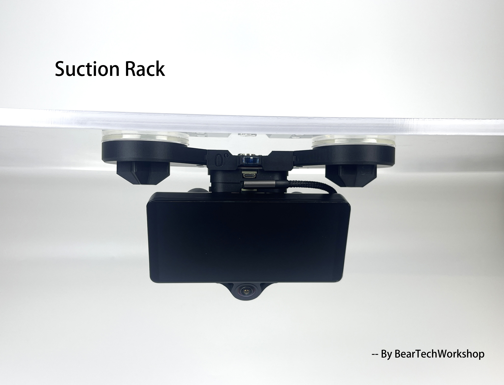

# Suction Rack

## Where to buy

Link to my Store:&#x20;

Suction Rack: [https://shop.beartech.ca/products/suction-rack](https://shop.beartech.ca/products/suction-rack)

Link to my Etsy Store:

Suction Rack: [https://www.etsy.com/ca/listing/4338610954/beartech-suction-rack](https://www.etsy.com/ca/listing/4338610954/beartech-suction-rack)

Link to RetroPilot Store:

Suction Rack: [https://shop.retropilot.org/product/beartech-suction-rack/](https://shop.retropilot.org/?post_type=product\&p=14689\&preview=true) ‎

***

## Update:

1/4 screw thick comma mount (the adapter that allows sliding your Comma directly onto the suction rack) for Suction Rack and Device Stand is **now available**. \
It would allow using a suction rack without using a slidemount or magmount.\
If you need that, please specify it in your order. \
It will only be send out **upon request**. Thank you.

## Product Description

**Suction Rack**

**What you will receive:**

<figure><figcaption></figcaption></figure>

**What it looks like after installation**&#x20;

<figure><figcaption></figcaption></figure> <figure><figcaption></figcaption></figure>

<figure><figcaption></figcaption></figure> <figure><figcaption></figcaption></figure> <figure><figcaption></figcaption></figure>

The Suction Rack is a versatile mounting solution designed for Comma 3 and Comma 3X users who prefer a **non-permanent, reusable installation method**. Responding to high demand from the community, this rack allows you to securely mount your device without the need for VHB tape on your windshield. It’s ideal for drivers who frequently move their device between vehicles or use rental cars.

### **Key Features:**

* **Angle Adjustability (0°, 8°, 16°):**\
  The Suction Rack includes three interchangeable angle inserts, allowing users to adapt to different windshield slopes. Whether your vehicle has a nearly vertical windshield or a steep rake, you can achieve the optimal viewing angle for your comma device.
* **Dual Suction Options:**\
  To provide flexibility for different use cases, the rack includes two types of suction cups:
  * **Sticky Suction Cup (“Sticky Cup”):** Features a lightly adhesive silicone surface for a stronger, more reliable hold. This is recommended for **long-term use** but remains reusable when kept clean.
  * **Standard Suction Cup:** A classic rubber vacuum cup that’s slightly less grippy but easier to attach, remove, and reuse across multiple vehicles.
* **Built-in Bubble Level:**\
  For hassle-free installation, the rack integrates a mini bubble level in its center. This feature allows users to quickly check and adjust the rack’s position for a perfectly horizontal setup, improving camera alignment and overall system performance.
* **Compatible Mounting:**\
  The rack is designed to work in conjunction with your existing **Magmount** or **Slidemount** (required, not included). Once installed, your comma device attaches securely and can be removed or repositioned as needed.
* Also **compatible with DSLR and GoPro** with the ¼ tripod screw included.

### **What is Included:**

* 1× Suction Rack Base with Integrated Bubble Level
* 3× Angle Inserts (0°, 8°, 16°)
* 1× Pair of Sticky Suction Cups
* 1× Pair of Standard Suction Cups
* 2× Decorative Star End Caps
* 1× Mounting Hardware Kit (screws, bars, and tools)

### **Recommended Use Cases**

* **Windshield with tint:** Sticking VHB on tint might ruin your tint. With the suction rack, you can remove your setup with ease.
* **Rental or Shared Vehicles:** Avoid leaving any residue on windshields when moving your comma device between cars.
* **Frequent Travellers:** Reusable and easy to pack for use in multiple vehicles.
* **Non-Permanent Installs:** For users who prefer not to apply permanent adhesives like VHB tape.

## **Use the Suction Rack with mounts:**

1. Magmount

If you already have a magmount set, you can remove the windshield mount from your windshield and install on the suction rack. \
If you intend to use the suction rack for additional vehicle/ travel, you can get the Suction Rack + Magmount Windshield Mount option to use the rack on rental vehicles\
Detailed description of magmount:


[magmount.md](magmount.md)


2. Slidemount

If you already have a slidemount set, you can remove the windshield mount from your windshield and install it on the suction rack. \
If you intend to use the suction rack for additional vehicle/ travel, you can get the Suction Rack + Slidemount Windshield Mount option to use the rack on rental vehicles\
For slidemount, you will need to leave 3.5cm (1.4 inch) horizontal space clearance for sliding.\
Detailed description of slidemount:


[slidemount.md](slidemount.md)


3. 1/4 screw thick comma mount

There are requests for using the comma device by itself on the suction rack, so we have included the adapter in the package.

### **How to Choose Your Mounting Option**

**Discounted bundle options available:**

* Rack only
* Rack + 1 Magmount set
* Rack + 1 Magmount set + 1 extra Magmount Windshield Mount
* Rack + 1 Slidemount set
* Rack + 1 Slidemount set + 1 extra Slide Windshield Mount

We offer several combinations of the suction rack and mounting kits to suit different users' needs — because everyone’s setup is a little different. Here are some examples to help you choose:

* **If you have one main vehicle** and want to **keep the mount stuck to your windshield**, while using the suction rack **for travel or rentals**, go with:\
  → **Rack + Slidemount (or Magmount) Set + 1 Extra Windshield Mount**
* **If you're using the suction rack on a single vehicle** and **don’t plan to remove it often**, then a simple\
  → **Rack + Mount Set** (Slidemount or Magmount) will be enough.
* **If you want to keep your Comma device on a stand at home** for log uploading or debugging, and also have a permanent mount in one car and a suction rack for travel, go with:\
  → **Rack + Mount Set + 2 Extra Windshield Mounts** (1 for the car, 1 for the home stand)
* **If you're sharing the suction rack between two vehicles** and bringing the same Comma device back and forth,\
  → **Rack + Mount Set** is a great minimalist solution.
* **If you want to leave a suction rack in each of two vehicles** but only have one Comma device, then you'll need\
  → **2 Suction Racks + 1 Mount Set**

There are many possible combinations depending on your routine. Some users prefer having multiple mounts at home and in the car; others prioritize flexibility for frequent travel. If you’re unsure, start with one rack + mount set, then expand as your needs grow.

##

## Installation Guide

<figure><figcaption></figcaption></figure>

Please join our discord to leave your feedback: [http://discord.innoisle.com/](http://discord.innoisle.com/)

***

